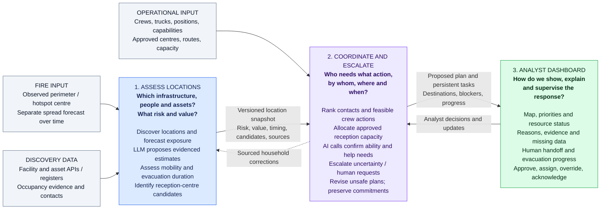

# ResponsAra — Practical Values-at-Risk MVP (v4)

Track 4, "Values at risk": Norrsken x Deepfire "AI for Wildfire" challenge, Hackbarna 2026.

**One incident, one bounded area, one analyst workflow:** identify priority locations, assign follow-up tasks, and update the queue as the fire changes.

This README is the current MVP scope and interface reference. Maintain project updates here; it supersedes the broader scope in `PLAN.md`.

The colleague builds **risk assessment**, which consumes fire updates, discovers facilities and emits location assessments. [@mirrdj](https://github.com/mirrdj) builds **analyst coordination**, which ranks those assessments and turns them into tasks, assignments and questions for the fire analyst. The shared contract is in section 5.

Use [Superpowers](https://github.com/obra/superpowers) for development. Work in a dedicated branch and worktree under this repository's `.worktrees/` directory, publish every task branch to `origin`, and push progress so colleagues can review it. See [AGENTS.md](AGENTS.md) for the persistent workflow.

## Three-component architecture

Architecture baseline recorded on 2026-09-19. The responsibility split remains current;
the implementation inventory and gaps below describe that dated baseline. Since then,
multi-crew planning, monetary-loss estimates, approved allocation records, call briefings,
coordination persistence and the read-only live dashboard have landed. See the module
sections and the 2026-09-20 integration checkpoint below for current wiring and limits.

This diagram describes the agreed responsibility split and proposed extensions, not a claim that
every arrow is implemented. **1 assesses what is exposed; 2 coordinates what to do; 3 shows the
recommendations and captures the analyst's decisions.** AI calling belongs to component 2.
The existing MVP remains one incident in a bounded area; multiple incidents and automatic
multi-crew scheduling below are design requirements for subsequent integration.



### 1 — Assess locations: exposure, vulnerability, value and reception candidates

**Questions:** What infrastructure/assets and associated populations are in the area? Which face
the earliest fire impact? Who may need assistance or more time? What equipment/property or critical
service is at stake? Which buildings merit evaluation as reception centres?

**Inputs checked against the repository on 19 September 2026:**

| Input | What the code/data currently provides | Remaining gap |
|---|---|---|
| Fire observation | `fire_input.py` normalizes Deepfire `satellite-perimeters` polygons, with `clusters` hotspot centres as fallback; incident ID, observation/receipt times, source and geometry kind accompany GeoJSON. Live and recorded paths exist. | A hotspot centre is not a measured boundary. Polling selects one incident/update; coordinated multi-incident state is not implemented. |
| Spread model | `DeepfireClient.start_spread_simulation` accepts a cluster ID **or** latitude/longitude, plus model, duration and ensemble size. On `claude/window-ranking`, `forecast_input.py` converts recorded hourly burned-area polygons to facility arrival estimates. | Point-ignition simulation is separate from the observed incident. The adapter assumes `createdAt` is simulation start and uses the first covering hourly polygon; neither exact arrival nor arrival quantiles are established by that conversion. |
| Facilities and people | Gencat API/register adapters and cached real-area facilities cover hospitals, schools, care homes and campsites. Matching extracts identity, coordinates where present, class and occupancy evidence. The latest colleague branch adds school-enrolment evidence. | No general API discovering every person/household, private equipment inventory or resident phone number. Enrolment/capacity are proxies, not confirmed people currently present. Authorized contact records are a separate input. |
| Value and duration | Class-based `value_score`/`value_basis` are operational importance. The colleague's v1.1 producer supplies `evacuation_min`/`evacuation_source` from explicit class-policy assumptions, with override support. | These are not monetary valuations or confirmed household evacuation times. Flammability and actual mobility need evidence; travel/transport and receiving arrangements can change duration. |
| Search extent | Current discovery uses the fixed Gavarres bounding box `(2.85, 41.80, 3.20, 42.05)` in longitude/latitude order. | No adaptive radius or validated confinement/suppression-capability model is wired into this path. |

Checked baseline: `main` at `59d8c23`; colleague's integration branch
[`claude/window-ranking`](https://github.com/rht/wildfire/tree/claude/window-ranking) at `f91178e`.
Its committed real spread example reaches **0 of 99 located facilities within its 12-hour horizon**;
those facilities have no arrival estimate. This demonstrates the adapter, not a usable automatic
contact order for that example. Outside the simulated footprint/horizon does not mean safe.

**Assessment workflow:** select the area, fetch/cache available datasets, resolve stable identities,
calculate geometric exposure and attach forecast estimates, then enrich gaps with an LLM that
uses cited evidence. The current agent can propose occupancy/capacity/class updates for analyst
confirmation; monetary valuation, flammability and mobility proposals are extensions. The LLM can
propose a monetary range with currency, inventory/area assumptions and source, and flag a care
home as likely to need assisted evacuation. It must not present those assumptions as verified
occupancy, ability, a burn probability or an exact market valuation. Keep unknown values null.
Human vulnerability, critical-service importance and monetary value remain separate dimensions.

**Reception candidates:** component 1 supplies location, forecast exposure, suitability evidence,
accessible capacity and supported needs. Component 2 checks current approval, route feasibility,
capacity reservations and the whole travel/reception time window before proposing a destination.
A hospital with firefighters present is not automatically safe or able to receive evacuees.
Reception is also distinct from sheltering in place; the latter needs its own authorized plan.

### Shared output from component 1

Reuse section 5's envelope and the colleague's **v1.1** location contract; do not replace it with an
unversioned LLM JSON response. One record represents a location and its associated population,
not a public list of named residents. Stable IDs link assessments to private contact/interview data.

| Data group | Existing / agreed field names | Proposed additions, not yet in the shared validator |
|---|---|---|
| Snapshot | `schema_version`, `scenario_id`, `incident_id`, `snapshot_id`, `sequence`, `as_of`, `computed_at`, `input_mode`, `data_status`, `assets` | Search-area geometry, selection basis, forecast coverage and policy version |
| Location | `asset_id`, `name`, `asset_type`, `latitude`, `longitude`, `geometry`, `area_m2` | Equipment/infrastructure inventory where sourced |
| People and duration | `capacity`, `estimated_occupancy`, `occupancy_basis`, `evacuation_min`, `evacuation_source` | Mobility/assistance estimates with basis and confidence; explicit duration components and transport assumptions |
| Exposure | `distance_to_fire_m`, `intersects_fire`, `fire_arrival_at`, `fire_arrival_basis`, `arrival_p10_at`, `arrival_p50_at`, `burn_probability`, `forecast_horizon_at`, `forecast_source` | Flammability evidence/estimate and its basis; keep it separate from forecast probability |
| Value | `value_score`, `value_basis` | Monetary estimate range, currency, method, source and review state; `value_score` remains operational importance |
| Reception candidates | Supplied separately in the readiness prototype as `ReceptionCentre` and `EvacuationRoute` records | Link candidates to `asset_id`; suitability, accessibility, approval authority, capacity freshness, supported needs and route evidence |
| Evidence | `needs_review`, `review_reasons`, `sources` | Field-level estimate/confirmed distinction and confidence where applicable |

Additions require a versioned producer/consumer agreement before implementation. Contact numbers,
call results, allocations and task progress belong to separate operational records; a new exposure
snapshot must not overwrite them. Component 1 supplies the baseline evacuation duration; component
2 must reassess it when a call changes mobility/transport facts or a destination/crew changes.

### How large should the search area be?

Prefer the **union of forecast footprints over a planning horizon, expanded by an explicit
uncertainty buffer**, to a circle around the ignition point. Include threatened access routes and
search separately for reception candidates beyond the affected footprint. Retain already contacted
locations and assigned work even when they fall outside the next search result.

The planning horizon must cover the next review interval plus the relevant notification,
mobilisation, preparation and onward-travel time, with an analyst-selected margin. If that exceeds
forecast coverage, expose the gap rather than treating the uncovered period as safe. Where a
defensible upper spread-speed estimate exists but only a circular API query is available, a
discovery approximation is `buffer distance = upper spread speed * horizon + uncertainty distance`
around the **current perimeter**. This is a query bound, not an evacuation boundary; it must account
for the extent of the existing fire and any separate ignitions. Do not invent the speed from distance.

**Do we have the inputs?** We have recorded spread geometry over time and a fixed discovery box.
We do not have a validated operational suppression forecast, live containment effectiveness, or
confirmed shelter-in-place capability in the current pipeline. Truck count alone cannot establish
containment success. Do not shrink the search area because crews are present; only incorporate a
sourced, current operational forecast with its uncertainty. For the MVP retain the explicit fixed
area, show coverage limitations, and let the analyst expand it; there is no justified universal radius.

### 2 — Coordinate and escalate: contacts, crews, destinations and human handoff

**Questions:** Who needs contacting first? Who can self-evacuate and who needs help? Which crew
action is feasible next, with what benefit? Where can people be received? Who owns unresolved cases?
What must change when a new incident or forecast invalidates an existing plan?

In addition to assessment snapshots, this component needs confirmed resource records: crew/truck
counts, identities, positions with timestamps, availability, skills, vehicle capacity, travel/action
times and existing commitments. A fire truck is not automatically an evacuation vehicle. The repo
has a manual capability/availability roster and task store, but no verified live fleet feed or
integrated multi-crew dispatch. The Bombers intervention feed identifies incidents, not a confirmed
available-crew inventory. The static response planner supports one crew and at most eight actions.

- **Contact order:** smallest `fire_arrival - now - evacuation_duration - buffer` first. Show exhausted
  windows and missing estimates for analyst review. Monetary value never overrides this urgency.
- **Crew recommendations:** require travel, action duration, capabilities, deadlines and explicit
  protective effects/prerequisites. Preserve the existing ordering of assisted people, total people,
  then asset value when comparing feasible response alternatives; proximity alone does not prove
  that protecting one building protects another. Surface unavailable resources and unserved locations.
- **Destination assignment:** use approved suitable centres, confirmed route information, current
  remaining capacity and required accessibility/care. Reserve capacity across households and keep
  existing reservations until explicitly changed. Nearby/valuable buildings are only candidates.
- **AI interview:** use an authorized contact record; confirm current location and household coverage,
  ability to self-evacuate, transport, need for assistance and whether a human is requested. Explain
  only analyst-approved incident/destination instructions. Unknown/low confidence, missing answers,
  contradiction, no answer, failed call/transfer or an explicit human request produce a persistent
  escalation task. Missing phone numbers remain unresolved contact work.
- **Human escalation:** attach the asset, deadline, concise evidence and reason; notify an operator,
  record acceptance/ownership, attempt configured live transfer, and retain a callback task if it
  fails. A transfer tool invocation is not proof of connection. A shrinking window can require an
  immediate resource decision instead of repeated call retries.
- **Progress:** track instruction version and acknowledgement, declared ability, assistance request,
  departure and arrival separately. Agreement to evacuate does not establish that anyone has left.

**Stable updates:** persist plans, tasks, reservations and communication history separately from
snapshots. Recompute affected uncommitted work; keep accepted assignments and communicated
destinations while they remain feasible. Raise an explicit revision for a newly threatened route,
centre or deadline, resource loss, or urgent new incident. The analyst confirms the change and the
system tracks who must receive and acknowledge revised instructions. Stability never hides an
invalid plan. Multiple incidents need a shared resource/capacity ledger and per-incident update
ordering so a truck or reception place cannot be allocated twice; that integration is future work.

**Output:** a proposed plan with source snapshot IDs, contact order, feasible crew recommendations,
destination reservations, reasons/uncertainties, unmet needs and persistent escalation/progress tasks.
Analyst decisions and call facts feed back into coordination; sourced household corrections can
also update the next assessment without rewriting the fire forecast.

### 3 — Show the response: analyst dashboard

**Questions:** What needs attention now, why, who owns it, and what changed? Which recommendations
can be accepted, which need evidence, and which households still need assistance or confirmation?

Show the fire observation and labelled forecast/horizon; risk/value layers; threatened locations;
candidate versus approved reception centres; and known resource positions with age. Display separate
contact, crew-action and human-escalation queues so their different objectives are visible. Each
location should show timing arithmetic, value basis, mobility evidence, destination/capacity,
contact outcome and acknowledgement/departure/arrival status. Unknown inputs remain visible.

The analyst can inspect evidence, approve a proposal, assign a capable available team, accept an
escalation, record a callback/outcome, override a sourced estimate and approve revised instructions.
Show a change log and explicit reasons for replanning. The UI displays component 2's versioned
results; it must not implement a competing priority formula. The existing Streamlit map, ranking,
tasks and investigation UI are the foundation; voice handoff, destination reservations and live
multi-crew views still need integration.

## Voice-agent delivery plan

**Owner:** [@mirrdj](https://github.com/mirrdj). **Status:** planned; implementation and calling
feasibility proceed in separate branches below. The SLNG API key will be supplied later. This
section is the shared plan; adding it to main does not mean a live voice agent is deployed.

**Goal:** contact a household in priority order, collect evidenced evacuation-readiness answers,
offer a person, and return a structured result to analyst coordination. Every household remains
visible until its outcome is confirmed, including households the firefighter sequence cannot visit.

The household-readiness prototype already exists on `codex/evacuation-readiness` at `5652c90`
(`fireline/evacuation_readiness.py`, `fixtures/evacuation_readiness.json`). It proposes
`self_evacuate`, `assisted_evacuation` or `undetermined`; it does not place calls. The SLNG branch
will include that dependency. @rht's window producer/consumer/ranking branches own the separate
snapshot/UI timing integration; avoid duplicating those changes.

### Parallel work and ownership

| Work | Branch | Worktree | tmux session |
|---|---|---|---|
| SLNG interview implementation | `codex/slng-voice-agent` | `.worktrees/slng-voice-agent` | `wildfire-slng` |
| Calling feasibility, macOS first | `codex/calling-research` | `.worktrees/calling-research` | `wildfire-calling` |

Use Superpowers, test behavior before implementation, keep all project documentation in this
README, and push each branch at meaningful checkpoints. Only this plan is authorized for main in
this step; workers retain their implementation/research on their own branches. Missing credentials
must not block local implementation, fixtures, tests or documentation. Session logs are local and
ignored; they are not project documentation or a place to store credentials.

### Shared flow and boundaries

```text
ranked location + analyst-supplied incident brief + approved contact
        -> voice interview (SLNG or later an alternative audio transport)
        -> structured call evidence and lifecycle events
        -> deterministic readiness checks
        -> proposed self evacuation / assistance / human follow-up
        -> analyst task state, with departure and arrival tracked separately
```

The existing risk/contact algorithms remain deterministic. The agent collects information; it
cannot change the fire forecast, choose an arbitrary nearby building, invent a safe route, issue an
evacuation order, or mark somebody evacuated from a completed call. A reception site must be
explicitly designated and have capacity and a usable route. A hospital qualifies only when it has
been designated for that purpose. The readiness module provides the existing static checks.

### Interview and result contract

Use a brief, explicit AI introduction and a clearly labelled simulated scenario in the first demo.
Relay only the incident brief supplied by the analyst. Ask one question at a time:

1. Confirm the intended location and whether the respondent can answer for everyone there.
2. Ask whether everyone can leave without emergency assistance; capture mobility or other help
   needs without inferring ability from age, property value or facility class.
3. Ask whether suitable transport is available for everyone and what preparation remains.
4. Ask whether they want to speak with a person. Honour that request immediately rather than
   requiring a low-confidence score first.
5. Read back the critical answers and obtain acknowledgement. If an approved instruction exists,
   confirm its receipt separately; do not equate acknowledgement with departure or arrival.

Proposed transport-neutral records (stable IDs link the call to the asset and snapshot):

```python
CallRequest = {
    "request_id": str, "asset_id": str, "snapshot_id": str,
    "contact_number": str,                 # E.164; local/private storage only
    "language": str, "incident_brief": str,
    "human_callback_number": str | None,
    "input_mode": "synthetic" | "recorded" | "live",
}
CallResult = {
    "request_id": str, "asset_id": str, "snapshot_id": str,
    "provider_call_id": str, "status": str,
    # queued, ringing, in_progress, completed, no_answer, failed, declined
    "observed_at": str,                    # UTC ISO timestamp; preserve original evidence time
    "identity_confirmed": bool | None,
    "whole_household_confirmed": bool | None,
    "can_self_evacuate": bool | None,
    "transport_available": bool | None,
    "wants_human": bool | None,
    "acknowledged": bool | None,
    "confidence": float | None,            # review signal, NOT probability of safety
    "confidence_basis": str | None,
    "evidence": dict,                      # answer field -> supporting transcript excerpt
    "contradictory": bool,
    "source": str,
    "human_followup_required": bool,
    "human_followup_reasons": list[str],
    "transfer_status": str | None,         # requested/connected/failed; not merely tool-called
}
```

Unknown answers remain null. A transport adapter maps this record into `CallAssessment` using a
common scenario epoch; it must reject wrong asset/call associations and future evidence. Persist
provider lifecycle facts separately from extracted answers. Duplicate callbacks must not create
repeated tasks or repeat a call; later-arriving old events must not downgrade a terminal state.
Store credentials only in the ignored `.env`; use the existing `fireline.env.load_env()` loader.
Do not write numbers, transcripts or credentials to public fixtures or logs; fixtures use synthetic
contacts and conversations. Retain only evidence needed for the analyst workflow in local storage.

### Workstream A: SLNG implementation

**Suggested files:** `fireline/voice_models.py` (request/result validation),
`fireline/voice_interview.py` (prompt and result normalization), `fireline/slng_voice.py` (provider
adapter), `fireline/voice_store.py` (call lifecycle persistence and task linkage),
`scripts/voice_demo.py` (offline and explicit live modes), `tests/test_voice_*.py`, synthetic JSON
under `fixtures/voice/`. Keep provider details outside the readiness algorithm.

- [x] **A1 — Contract and offline interview.** Read the existing readiness module. Write failing
  tests for a confirmed self-evacuating household, assistance needed, requested person, low/unknown
  confidence, missing evidence, contradictory answers and no answer. Implement validation and
  normalization; demonstrate all outcomes without an API key. Assert that no-answer/low-confidence
  results cannot become `self_evacuate` and that every location retains a follow-up path.
- [x] **A2 — SLNG adapter.** Verify current official API schemas before writing the client.
  Implement explicit configuration, HTTP timeouts, sanitized errors, agent configuration and
  browser-session creation; separate outbound dispatch from both. Validate `SLNG_API_KEY`, agent ID
  and outbound-connection requirements. Use injectable HTTP transport in unit tests. Do not blindly
  retry an ambiguous call-creation timeout, since that may dial twice. A missing key produces a clear
  not-configured result while the offline demo continues to work.
- [x] **A3 — Results and human handoff.** Add authenticated result ingestion or a verified polling
  path (choose based on current SLNG support). Persist requests/results, enforce idempotency and
  ordering, and map only evidenced answers to the readiness input. Add a human callback task for a
  requested person, low/unknown confidence, incomplete interview, bad audio, no answer or failed
  transfer. Do not label a transfer successful before the provider confirms connection. Extend
  `TaskStore` only where needed, preserving assigned work across snapshots and restarts.
- [x] **A4 — Demonstrable local flow.** Provide an offline command that consumes the same location
  fixture and prints the call result, proposed mode and remaining tasks. Test restart/replay, wrong
  call identity, timeout, duplicate event and failed transfer. Keep any UI adapter separate from
  @rht's ongoing priority/UI work. Run the full Python suite, request code review, document exact
  commands and limitations here, commit and push the branch.
- [ ] **A5 — Credentialed verification, later.** After the API key and test destination are supplied,
  test one browser conversation, then one explicitly requested phone call to a consenting teammate,
  then human transfer. Record actual outcomes without publishing personal data. Credentials alone
  do not imply telephony is configured or authorize calling arbitrary asset contacts. Live behavior
  stays marked unverified until these checks have run.

**Acceptance:** an offline demonstration and tests work without credentials; provider code is ready
for a supplied key; structured answers reach the readiness checks; uncertain or requested human
contact creates a durable task; no household is silently treated as evacuated. Report live versus
simulated behavior explicitly. The initial demo language is configurable English; Spanish/Catalan
model availability and quality require explicit provider selection and a later spoken test.

### Workstream B: calling from macOS, Raspberry Pi fallback

**Priority:** reuse the available Mac and a regular mobile phone/SIM if feasible. A Pi is useful
only if Linux supplies a required bridge that macOS cannot provide. Existing modem: Huawei
E3372-325 HiLink. Its documented data/SMS support does not establish voice/audio support.

- [ ] **B1 — Verify macOS paths.** Research official Apple/CoreBluetooth/audio documentation and
  maintained primary-source projects. Distinguish initiating a call (including iPhone Continuity)
  from programmatically capturing AND injecting call audio. Check Android/iPhone Bluetooth HFP,
  USB or wired audio alternatives and whether human handoff is possible. Mark each claim as
  documented, locally tested, hardware-dependent or unsupported; no claim that pairing alone is
  sufficient. Inventory relevant local software read-only without probing personal communications.
- [ ] **B2 — Evaluate Linux/Pi fallback.** Check Asterisk `chan_mobile`/BlueZ requirements for the
  actual phone and current Linux setup. Separately assess a voice-capable modem with accessible
  audio. Do not assume E3372-325 compatibility from a different Huawei model, flash firmware, or
  modify the existing Vibecat dongle fleet. Read only narrowly relevant local model notes; never copy
  private fleet numbers, SIM identities, PINs or credentials into this repository.
- [ ] **B3 — Produce a concrete recommendation.** Update this README's calling-feasibility findings
  with a comparison of hardware, software, call control, two-way audio, expected setup effort,
  concurrency limits and still-needed tests. Prefer a runnable local diagnostic script such as
  `scripts/check_calling_host.py` if it helps establish capability without calling anyone. Explain
  how audio would reach SLNG (managed telephony/SIP versus a custom STT/LLM/TTS bridge); those are
  different integrations. Include exact next steps for the strongest macOS path and the Pi fallback.
- [ ] **B4 — Verify and publish.** Test any added script, attach direct primary-source links to the
  findings, record blockers requiring a phone/Pi/carrier detail, commit and push. Do not buy hardware,
  pair a personal phone, record conversations, place calls or change system services as part of this
  research task. Hardware-dependent validation is a subsequent explicitly targeted test.

**Acceptance:** a defensible macOS-first answer with a reproducible path or a specific blocker; a
Pi/Linux fallback that addresses both dialling and audio; a clear separation between SIM voice and
using a SIM only for internet. A documented negative result is useful; an untested workaround must
not be presented as working.

### Integration and verification checkpoints

Run focused tests after each component and the full suite before each handoff. Useful commands:
`uv venv`, `uv pip install -e ".[dev]"`, `.venv/bin/python -m pytest -q`, `git diff --check`.
The readiness dependency has 253 passing tests at its own commit; establish a fresh baseline in
whichever combined tree is used. Public documentation remains this README only. Both workers push
without merging to main; review the combined result before integration. Neither worker should wait
idle for an API key while offline work remains.

Sources checked on 19 September 2026:
[SLNG managed agents](https://docs.slng.ai/voice-agents),
[SLNG configuration](https://docs.slng.ai/examples/agents-config),
[SLNG API examples](https://docs.slng.ai/examples/agents-api),
[event challenges](https://www.hackbcn.com/en/events/aisummit26),
[Asterisk mobile-channel features](https://docs.asterisk.org/Configuration/Channel-Drivers/Mobile-Channel/Mobile-Channel-Features/),
[Asterisk requirements](https://docs.asterisk.org/Configuration/Channel-Drivers/Mobile-Channel/Mobile-Channel-Requirements/),
[E3372-325 specifications](https://brovi-tech.com/productshow.php?cid=2&id=248),
[SIM7600 voice/audio example](https://www.waveshare.com/wiki/SIM7600X_Raspberry_Pi_Raspbian_Voice_Call).

## 0. Quickstart and repository layout

```sh
make setup        # uv venv + uv pip install -e ".[dev]"
make test         # pytest, no network, no LLM key (tests/conftest.py strips the keys so .env cannot leak in)
make snapshots    # rebuild fixtures/snapshots/ (synthetic fire + synthetic forecasts; real facilities + real perimeters + labelled CA arrival enrichment) with scripts/make_snapshots.py
make demo         # streamlit run fireline/app.py: map, ranked table, review queue, tasks, change log
                  #   (the sidebar steps and scrubs through the snapshot sequence, back as well as forward)
make investigate  # one agent investigation; live with NEBIUS_API_KEY (or ANTHROPIC_API_KEY), else a labelled prerecorded replay
make fetch        # pull real Gencat registers and Open-Meteo wind into data/ (network)
make precompute   # v0 engine demo (spread CA, routing, decisions); the same uncalibrated CA enriches gavarres_real_0001..0003 (labelled, see below)
```

The coordination dashboard retains Michella's visual design and reads backend state through
REST/WebSocket. Install the pinned development dependencies and run its checks:

```sh
npm ci
npm test
npm run lint
```

The tests verify that snapshot-controlled IDs, names, types, review reasons and provenance render
as literal text across ranking, review selection, location detail, map tooltips and the change log.
They cover supplied route/fire geometry, independent call outcomes, reconnects and revision order.
Dispatch controls remain disabled; the screen cannot create tasks, assign teams or assert an
evacuation. The jsdom installation is test-only and adds no production JavaScript framework.

The earlier static mockup's Norma Livecheck returned zero findings for HTML under full coverage. Its extracted
inline JavaScript and the identical JavaScript form of the CommonJS regression test also returned
zero findings, but with reduced coverage because one Semgrep rule failed to load. Those JavaScript
results therefore do not establish an unqualified clean scan or cover the newer modular dashboard.
The live-dashboard section records its separate scan scope and limitations.

`CONTRACTS.md` (v1.1) holds the module APIs that implement section 5 and the coordination side.
`fireline/` has `snapshot.py` (producer), `fire_input.py` (Deepfire poll or recorded responses, stale
status, latency), `forecast_input.py` (per-location fire arrival estimates: a labelled forecast file or
a Deepfire fire-spread run), `priority.py` and `tasks.py` (consumer: evacuation-window ranking, SQLite
tasks, roster, confirmed overrides), `agent.py` and `llm.py` (five-tool investigation), `app.py`
(Streamlit) and `config.py` (policies and feature flags). The v0 engine (`spread.py`, `routing.py`,
`decide.py`, `scenario.py`, `grid.py`, `fire_state.py`) stays in the tree behind `config.FEATURES`,
off by default.

**Ranking as implemented (2026-09-19):** the snapshot pipeline ranks by the remaining evacuation
window of section 6 (`priority.rank_snapshot`, sharing the arithmetic and ordering of section 16's
`contact_priority.rank_contacts`); the earlier weighted proximity–size–value score is removed.
"Current time" is the snapshot `as_of`, the buffer is 30 minutes (`config.CONTACT_POLICY`). Evacuation
durations come from `config.EVACUATION_POLICY`, a versioned class-based prototype (mobilisation,
preparation/loading, movement, with the assistance and transport assumptions in each asset's
`sources`) that the analyst can override per asset; nothing is derived from headcount. Fire arrival
comes from a forecast input: the synthetic scenarios use hand-designed, labelled synthetic forecasts
(`fixtures/forecast/`); Deepfire fire-spread was verified live on 2026-09-19 but only runs forward from
the current hotspots, so no provider forecast covers the recorded July incident. The `gavarres_real_0001..0003`
snapshots therefore carry a **labelled model enrichment** instead: the v0 cellular-automaton spread
ensemble (`fireline/spread.py`, `config.CA`, Alexandridis et al. 2008 style, not calibrated on Gavarres)
seeded from each real recorded perimeter, driven by the real recorded Open-Meteo previous-runs wind for
the snapshot hour (`fixtures/wind/`), 20 runs, 12 h horizon, 100 m cells, no fuel or slope layers, one
wind sample per snapshot. Assets its burned area reaches within 12 h get `fire_arrival_at = arrival_p10_at`,
`fire_arrival_basis = "p10 (ca_ensemble, labelled enrichment, not validated)"`,
`forecast_source = "ca_ensemble (labelled enrichment, not validated)"`, a horizon, a `burn_probability`
and a `sources` entry, and are ranked (18, 65 and 94 of the 99
located facilities in snapshots 0001..0003); the rest keep a null arrival and stay unranked
(`forecast_unavailable`). The CA is a stand-in, not a provider forecast and not validated: it spreads much
faster than the real fire did (its p50 burned area at 12 h is about 10,000 ha, against the real growth from
1,263 to 3,867 ha over about 17 h), so its arrivals are early and its ranking is a demonstration of the
pipeline on real inputs, not an assessment of the July incident. Nothing is inferred from distance.
`gavarres_real_0004` holds a real recorded Deepfire fire-spread run seeded at the July centroid; its 12 h
burned area reaches no facility, so its 99 located assets carry `burn_probability = 0.0` with the run named
as their `forecast_source` -- the run's own statement about those locations -- and every asset stays
`forecast_unavailable` for want of an arrival.

What is real and what is synthetic: the facilities in `fixtures/real_area/` are a real Gencat
Equipaments and schools extract for the Gavarres area (2026-09-19), with real enrolled-pupil counts
for the schools from the Gencat enrolment register; care homes and campsites carry no
coordinates in their registers and are listed with `location_unknown`. The `gavarres_real` snapshots
use **real recorded Deepfire satellite perimeters** of the July 2026 incident in the bbox
(`fixtures/fire/deepfire/real/`, pulled on 2026-09-19 with the credentials in `.env`, loaded by
`fireline/env.py`); the `synthetic_gavarres` snapshots and the top-level recorded responses are
**synthetic**, built to the same schema, as are the forecasts in `fixtures/forecast/`.
`fixtures/evidence.json` is labelled manual enrichment. The wind in `fixtures/wind/` is **real recorded**
Open-Meteo previous-runs data (model `ecmwf_ifs025`, `_previous_day1` slice: the run initialised about 24 h
before the valid time, hour containing each snapshot `as_of`, 0.1 deg grid point nearest the perimeter
centroid). The **fire arrivals on the real scenario are a model output**, the uncalibrated CA ensemble
above, labelled as such in `forecast_source` / `fire_arrival_basis`; no located register row carries a
capacity, so occupancy on the real scenario is still an investigation item. Real assets the CA does not
reach in 12 h sit in the review queue.
Tasks and overrides persist in `data/fireline.sqlite` (`FIRELINE_DB`). Recorded check outcomes are in
`VALIDATION.md` (`scripts/validate.py --write`).

## 1. Product and first milestone

"A fire update arrives. These locations need attention first, here is why, and here is what each team needs to investigate or confirm."

The analyst sees ranked facilities, investigates missing information, assigns follow-up work, and sees what changed on the next update. This supports decisions about facilities that may need evacuation by surfacing exposure, occupancy, access concerns and resource needs. The MVP does not calculate evacuation orders or safe routes.

**First milestone: the entire loop works against a fixture snapshot.** A second snapshot changes the ranking while preserving an existing assignment. Connecting real data must not block coordination development.

The [challenge brief](https://github.com/rht/wildfire/blob/main/challenge.md) emphasises real data, results in or near real time, and clear operator use. Demonstrate these through one real incident feed, measured update processing, and an analyst completing a concrete workflow. The agent investigates missing facility information and escalates what it cannot establish.

## 2. Scope

| Area | MVP commitment |
|---|---|
| Incident | One selected fire and a fixed bounding box, chosen based on accessible real data. |
| Facilities | Two or three classes from one cached dataset. Start with schools and care homes if coverage permits; add campsites only if readily available. Include every matching facility in the area. |
| Fire input | One provider, Deepfire, polled for updates. Recorded responses feed the same pipeline. |
| Exposure | Distance, overlap and per-location spread-predicted arrival, with source and age visible. A forecast is required for the contact order. |
| Ranking | Predicted time to impact minus total evacuation duration and buffer; missing inputs remain in review. |
| Coordination | Follow-up tasks, manual team assignment, capability/availability checks, status and blocking questions. |
| Agent | Investigate unknown occupancy, ambiguous class or unassessed criticality against cached evidence; propose a sourced update or escalate. |
| Interface | Map, ranked location table, selected-location details, task queue and change log. |
| Validation | Matching, geometry, scoring, missing-data behaviour, update latency and task persistence. |

Deferred from day one: custom spread models (the existing uncalibrated v0 CA is used only as a labelled enrichment on the real scenario, not developed further), fuel/elevation rasters, wind what-ifs, multiple satellite feeds, Catalonia-wide discovery, road graphs, route calculation, road-cut forecasts, automatic confine/evacuate rules, receiving-centre optimisation, population allocation, all-building discovery, automatic team scheduling, free-form chat and multilingual alerts.

## 3. Architecture and update flow

```text
Deepfire poll OR recorded provider responses
                      |
                      v
             Current fire snapshot       Cached facility dataset
                      |                           |
                      +-------------+-------------+
                                    v
                    RISK ASSESSMENT — colleague
                    Find facilities in the area
                    Attach size/value information
                    Calculate exposure and data gaps
                                    |
                        Shared location snapshot
                              (section 5)
                                    |
                                    v
                    ANALYST COORDINATION — @mirrdj
                    Calculate explainable priorities
                    Create/update follow-up tasks
                    Preserve analyst assignments
                         |                    |
                 Team roster          Focused agent triage
                 Analyst input        Evidence or question
                         +---------+----------+
                                   v
                         Map and analyst queue
```

Use one processing path for live and recorded inputs. The initial stream is periodic API polling; no message broker is needed. Cache the latest valid response, deduplicate updates and display stale-data status when polling fails. Honour provider rate limits and retry guidance.

Keep all matching facilities in the fixed area across updates, including those whose exposure decreases. Missing measurements must not look like a location becoming safe. Use stable asset IDs. Updating exposure must not erase analyst decisions, evidence or task history.

Use a sorted asset table for ranking. A graph is deferred until route connectivity or shared exits are actually calculated.

## 4. Minimal data preparation

| Need | Source and treatment |
|---|---|
| Fire footprint | Deepfire for one incident. Cache original responses and timestamps. Confirm authentication and one usable response at kickoff. |
| Facility location/class | One Gencat Equipaments extract for the selected area. Cache it, record extraction time and preserve source IDs. |
| Size | Estimated people present where sourced. Capacity may be a clearly labelled proxy; it is not a confirmed headcount. Missing values remain null. |
| Value | Analyst-configured operational importance by facility class: a prototype policy, not monetary valuation or an established emergency-service rule. Euros appear only in the optional value-at-risk layer (section 5.2), from a separate assumed per-class replacement-cost policy, and never enter the ranking. |
| Criticality | Per-asset, for the classes a class average cannot describe (`CRITICALITY_POLICY["assess_classes"]`): a tier and its named factors, proposed by the investigation agent from quoted evidence and confirmed by the analyst. A separate strategic view; it never enters contact urgency. Behind `FEATURES["asset_criticality"]`, on since 2026-09-20. |
| Notability evidence | Committed Wikipedia/Wikidata extract (`fixtures/notability.json`) for the criticality question only: title, url, intro summary, instance-of, operator, inception, with fetch times. Read offline; most facilities have no record, which is the answer for an ordinary school. |
| Investigation evidence | Small cache of registry records or facility pages with URLs, snippets and dates. Label manual enrichment; avoid several ingestion pipelines. |
| Teams | Manually entered or fixture roster with team IDs, capabilities, availability and source labels. |
| Spread forecast | Provided per-location fire arrival estimates, with source and estimate semantics. Without a usable forecast, show an unranked review queue; do not substitute distance for arrival time. |
| Evacuation duration | Sourced estimate including mobilisation, preparation/loading and movement to a receiving location. Record assistance/transport assumptions; do not guess duration from headcount alone. |

Select classes after inspecting coverage. Include the complete matching set within the area instead of selecting only interesting facilities. If a desired class lacks usable coverage, select another covered class and disclose the limitation.

Calculate minimum distance between asset and fire footprints; overlap gives zero. Fall back to the representative asset point and label the approximation when its footprint is missing. Use an appropriate metric CRS (EPSG:25831 for the selected Catalan area), while exchanging WGS84 coordinates. A hotspot centre without a usable footprint is not silently treated as a surveyed fire perimeter.

Distance-based exposure is not burn probability or time to impact. Keep unsupported forecast fields null and display "forecast unavailable". Do not infer arrival quantiles or probability from distance. The CA enrichment on the `gavarres_real` snapshots satisfies this rule as a provided per-location arrival estimate: it is a spread simulation seeded from the observed perimeter and the recorded wind, its `forecast_source` and `fire_arrival_basis` name the method and its unvalidated status, and locations it does not reach keep null fields.

Recorded responses demonstrate update handling. Only claim historical as-of replay when availability times for all inputs, including facility evidence, are established. Otherwise label it a recorded-input demo; do not claim lead time against historical evacuation decisions.

## 5. Shared location assessment contract

One record represents **one facility in one scenario snapshot**. Coordinates are attributes, not identity. The colleague owns the producer; @mirrdj owns its consumer. Both develop against the same fixture from the first milestone.

### 5.1 Snapshot envelope

| Field | Type and meaning |
|---|---|
| `schema_version` | String; `1.1` for this MVP contract (`1.0` files still load; their timing keys read as null). |
| `scenario_id`, `incident_id` | Strings identifying the scenario and source incident. |
| `snapshot_id`, `sequence` | Unique snapshot string and monotonically increasing integer within the scenario. |
| `as_of`, `computed_at` | UTC timestamps: information cutoff and calculation completion. |
| `input_mode` | `live`, `recorded` or `synthetic`; fixtures are explicitly synthetic. |
| `fire_observed_at`, `fire_source` | Nullable observation timestamp and source identifier. |
| `fire_geometry` | Nullable GeoJSON footprint for display and distance calculation. |
| `data_status` | `current`, `stale` or `unavailable`, with freshness thresholds in configuration. |
| `assets` | Complete array of matching facilities in the scenario's fixed area. |

Ignore duplicate snapshot IDs and lower/equal sequences within a scenario. Preserve snapshots for debugging and replay. A complete snapshot replaces exposure data, not the separate task store. Unexpectedly absent facilities trigger review, not task closure or an all-clear.

### 5.2 Per-location fields

All keys are present, except the optional value-at-risk layer below, which is present in full or not at all. Unknown measurements are `null`, not zero. Times are ISO 8601 UTC; distances are metres; normalised scores and probabilities are in [0, 1]; monetary values are euros. GeoJSON coordinates use longitude, latitude order.

| Fields | Type | Meaning |
|---|---|---|
| `asset_id`, `name`, `asset_type` | Strings | Stable identity, name and class; `unknown` for unresolved class. |
| `latitude`, `longitude` | Numbers or null | WGS84 representative point; both null when unresolved. |
| `geometry` | GeoJSON or null | Facility footprint when available. |
| `area_m2` | Nonnegative number or null | Optional footprint area; not an input to contact urgency. |
| `capacity`, `estimated_occupancy` | Nonnegative integers or null | Maximum people versus estimated people present. |
| `occupancy_basis` | String or null | Evidence or estimation method; capacity used as a proxy is explicit. |
| `value_score`, `value_basis` | Number or null; string or null | Class-based operational importance and versioned analyst policy. |
| `criticality_tier`, `criticality_factors`, `criticality_basis` | String or null; array of strings or null; string or null | Per-asset criticality above the class average, and the closed-enum factors that justify it (`config.CRITICALITY_POLICY`). The producer never asserts a tier: it arrives only through an analyst-confirmed override of an agent proposal, and all three are null together. Optional keys, like the v1.1 timing keys: a snapshot written before this layer stays valid. |
| `distance_to_fire_m`, `intersects_fire` | Nonnegative number or null; boolean or null | Geometric exposure; record point/footprint approximation in provenance. |
| `burn_probability` | Number or null | Optional provider estimate over its documented horizon; null when unsupported. `0.0` is a value, not a gap: the forecast covers the location and puts no fire there within its horizon. Null means no forecast covers it. Neither is derived from distance. |
| `arrival_p10_at`, `arrival_p50_at` | Timestamps or null | Optional arrival quantiles only when supported by the provider. Null does not establish safety. |
| `forecast_horizon_at`, `forecast_source` | Timestamp or null; string or null | Forecast horizon and source/method; required provenance for forecast-based contact ranking. |
| `fire_arrival_at`, `fire_arrival_basis` | Timestamp or null; string or null | Selected spread-predicted arrival estimate and meaning, e.g. p10 when supported. Never infer it from distance alone. |
| `evacuation_min`, `evacuation_source` | Nonnegative number or null; string or null | Total estimated evacuation duration in minutes, including mobilisation, preparation/loading and onward movement, with its basis. |
| `people_exposed` | Nonnegative number or null | Optional value-at-risk layer: `estimated_occupancy` x `burn_probability`. |
| `people_at_risk_p50`, `people_at_risk_p10` | Nonnegative integers or null | The whole `estimated_occupancy` when the remaining evacuation window at that arrival quantile is exhausted, else 0. |
| `replacement_value_eur`, `replacement_value_basis` | Nonnegative number or null; string or null | Assumed per-class replacement cost and the policy that gave it; null together, and null for a class the policy does not value. Not a per-asset valuation. |
| `expected_loss_eur_low`, `expected_loss_eur_mid`, `expected_loss_eur_high` | Nonnegative numbers or null | `burn_probability` x the class damage ratio x `replacement_value_eur`, at the low, mid and high ratio. |
| `needs_review`, `review_reasons` | Boolean; array of strings | Such as `location_unknown`, `occupancy_unknown`, `occupancy_seasonal`, `class_ambiguous`, `value_unknown`, `exposure_unknown`, `criticality_unassessed`. |
| `sources` | Array of objects | Field-level provenance: `fields`, `source`, `observed_at`, `available_at`, `fetched_at`, `notes`. Unknown source times remain null. |

**Value at risk** (`people_exposed` through `expected_loss_eur_high` above) is an optional layer behind `config.FEATURES["value_at_risk"]`, off by default. All eight keys are present together or absent together; `schema_version` stays `1.1` and a snapshot without them is valid, so a producer with the flag off emits exactly what it emitted before. The layer is computed after the forecast, never from distance:

```text
people_exposed         = estimated_occupancy x burn_probability
people_at_risk_p50     = estimated_occupancy if slack_p50 <= 0 else 0
people_at_risk_p10     = estimated_occupancy if slack_p10 <= 0 else 0
expected_loss_eur_low  = burn_probability x d_low x replacement_value_eur      # mid and high alike
slack_pXX              = arrival_pXX_at - evacuation_min - buffer - as_of
```

`slack_pXX` is the remaining evacuation window of section 6 evaluated at that arrival quantile rather than at the selected arrival. The threshold is `<= 0`, the boundary of `window_exhausted`, because `people_at_risk` re-labels that status weighted by headcount; it counts the whole headcount of such an asset and does not model partial clearance. Occupancy means `estimated_occupancy`; `capacity` is never used as a headcount here. Every field is `null`, never zero, when an input is null: no headcount, no `burn_probability`, no `evacuation_min`, no forecast covering the asset, no location, or a class the policy does not value. A `burn_probability` of `0.0` is a statement rather than a gap and yields zeros, and an asset a forecast covers but does not reach inside its horizon is not at risk (`0`), not unknown.

Replacement values and damage ratios are assumed per-class placeholders from `config.VALUE_AT_RISK_POLICY` (`value_basis = "assumed"`), standing in for a per-asset figure; the band shown is the damage-ratio band only, so the value uncertainty is at least as large. The euros are total economic loss, insured and uninsured, not an insurer's figure. **Euros never enter the ranking, the sort or any filter**: they are a display column and a scenario header total, and there is no euro figure for lives anywhere in the UI. `value_score` is unrelated and unchanged: it stays a class-based operational-importance score and is not derived from this table. The fatality chain, a value of a statistical life, VaR and CVaR, a Catastro footprint fetch and a land ledger are deliberately not built; `docs/VALUE_AT_RISK.md` keeps them as the upgrade path.

For historical replay, evidence must have been available by `as_of`; missing availability information cannot establish that. Document any forecast-to-asset aggregation method. Missing forecasts do not block ingestion or manual tasks, but they do block automatic contact ranking.

## 6. Contact priority from the evacuation window

Use fire-spread prediction to express proximity in time: how long until the fire reaches each location. The contact order depends on how much of that time is needed to evacuate.

```text
time_to_impact = predicted_fire_arrival - current_time
latest_start = predicted_fire_arrival - total_evacuation_duration - buffer
remaining_window = latest_start - current_time
```

Rank by **smallest remaining window first**, then earlier predicted arrival, nearer geographic distance, and stable asset ID. A farther asset may be more urgent because the fire is spreading toward it or its evacuation takes longer. Geographic distance does not replace a forecast or receive an arbitrary weight.

The evacuation estimate includes mobilisation, preparation/loading and onward movement to the receiving location. Assistance needs, transport availability and occupancy inform this duration rather than acting as separate ranking weights. Property value does not override contact urgency. Neither does per-asset criticality: `criticality_tier` is absent from the sort key and from every filter, and the strategic view it drives is read alongside the contact queue, never instead of it. Estimates must have a source; the static prototype uses explicitly synthetic forecast and duration inputs.

A zero or negative window stays at the top with `window_exhausted`: immediate analyst review is needed, not an automatic evacuation instruction. Missing forecast, evacuation duration or provenance produces an unranked review item. No probability, arrival time or duration is fabricated from distance or headcount. A missing distance does not prevent ranking when the forecast and evacuation estimate are known.

Coordination emits `rank`, `slack_min` (remaining window), `latest_start_min`, `time_to_impact_min`, `status`, `components`, forecast/evacuation sources and `review_reasons`. This replaces the weighted contact score. The static API uses `fire_arrival_min` relative to a common scenario epoch and `ContactPolicy(now_min, buffer_min)`; live timestamps must be converted to that same epoch. The selected arrival estimate must state its semantics; use a conservative quantile only when the provider actually supports it.

Response sequencing remains a separate constrained calculation using action deadlines, capabilities and explicit benefits/prerequisites (section 16). Static action durations are not automatically treated as total evacuation durations.

## 7. Analyst tasks and team coordination

Use four actions: **confirm occupancy**, **contact facility**, **check access**, and **request resources**. Access is an analyst-entered concern or question, not a computed safe route. Destinations may be analyst notes, without automated suitability or route calculations.

Suggest tasks from data gaps and let the analyst add follow-up work for any asset. Deduplicate open suggestions by asset and action/reason across snapshots. Only an analyst reopens a completed task; materially changed evidence can raise a new review flag.

| Task fields | Meaning |
|---|---|
| `task_id`, `asset_id`, `action`, `reason` | Stable work item, facility, concrete action and explanation. |
| `status` | `open`, `assigned`, `in_progress`, `blocked` or `done`. |
| `required_capabilities`, `assigned_team_id` | Capability tags and nullable team assignment; the analyst selects the team. |
| `deadline_at`, `deadline_basis` | Nullable analyst-entered target time and rationale. Distance alone never generates a deadline. |
| `blocking_questions`, `evidence`, `notes` | Outstanding information, evidence references and analyst notes. |
| `created_at`, `updated_at`, `based_on_snapshot_id` | Audit context and latest exposure review. |

A team with an active assignment is unavailable for another in the MVP. Reject unavailable or capability-mismatched selections with an explanation; do not infer capability from names. A blocked assigned task keeps the team reserved until the analyst releases or reassigns it. Resource requests may remain unassigned and blocked. This is an availability check, not travel-time or multi-team scheduling.

Persist tasks and confirmed overrides separately from incoming exposure. New snapshots refresh priority and flag affected tasks without changing owners or status. Preserve tasks for missing assets and show the missing assessment. Keep override provenance and surface conflicts with new provider data.

## 8. Focused agent workflow

Implement one bounded loop for unknown occupancy or ambiguous class:

1. Read the selected asset and its review reasons.
2. Look up evidence in cached registry/page records.
3. Propose a sourced field update or produce a concrete question for the analyst.
4. On analyst confirmation, persist the override, recalculate the remaining evacuation window and update the existing task.

Five tools suffice: `get_asset`, `lookup_facility`, `lookup_notability`, `propose_update`, and `escalate`. Keep evidence and tool calls visible, cap investigation steps, and leave unsupported questions unresolved. All field updates require analyst confirmation in this MVP. The agent does not directly assign teams or change scoring policy; calculation stays in code.

`lookup_notability` answers the criticality question and only that one: whether this particular building is worth more than the class average - a research institute, the fire brigade's own station - reading the committed `fixtures/notability.json` extract, never the network. The model proposes a tier from `CRITICALITY_POLICY` plus the closed-enum factors that justify it; the tier is refused unless it carries the minimum number of factors, so the top tier cannot rest on prose. Calculation still stays in code: the policy owns what a tier means, and the tier reaches an asset only through the same analyst confirmation every other field uses. Criticality never reorders the contact queue (section 6).

No general chat, live web research, alert drafting or wind what-if tools are needed. An LLM failure leaves the question answerable manually. Demonstrate one actual investigation call; label any prerecorded fallback output.

**Model as implemented (2026-09-19):** the loop runs on `deepseek-ai/DeepSeek-V4.1-Flash` through
Nebius AI Studio's OpenAI-compatible endpoint (`fireline.llm.NebiusLLM`, key `NEBIUS_API_KEY` in the
ignored `.env`, model overridable with `FIRELINE_MODEL`); `fireline.llm.live_llm()` falls back to
`AnthropicLLM` when only an `ANTHROPIC_API_KEY` is present. It was chosen by running this same loop
over the flagged fixture assets on five open-weight models: it and Kimi-K3 were the only two that
handled all cases without stalling or returning an empty message, at a twelfth of Kimi's cost. The
offline `FakeLLM` remains the default when no key is configured, so the tests and `scripts/validate.py`
stay reproducible; `scripts/validate.py --live` records what the real model did in `VALIDATION.md`.

## 9. Interface and implementation

One screen contains the fire/facility map, ranked table, visible review queue, selected-facility evidence and timing breakdown, team/task controls, and change log. Show input mode, timestamps and stale-data state. Live and recorded inputs use the same screen; a "next update" control suffices for the demo. When the snapshot carries the value-at-risk layer (section 5.2) the header adds people exposed, people at risk and expected loss with its band, each stating how many located assets are excluded for a null input, and the ranked and review tables gain the matching per-asset columns; the euro column is a display string with its band, never a sort key.

**Moving through the sequence (2026-09-19):** the sidebar walks the scenario's snapshots in both directions - "Previous" / "Next update" and a slider labelled with each snapshot's `as_of` (`1 - 2026-07-03 13:20Z` ... `4 - 2026-09-19 13:49Z` on `gavarres_real`). Forward past the store's accepted sequence applies the update as before (exposure bookkeeping, affected tasks, suggested tasks). Anywhere at or below it is a **view**: the snapshot is re-ranked with the analyst's confirmed overrides and shown on the map, the ranked table and the review queue, while tasks, the change log and the store's accepted sequence stay where they are and nothing is suggested from the earlier moment. The store's snapshot log is append-only (`tasks.SnapshotSequence`), so an earlier moment is reviewable but never replayed; a banner says which sequence is under review and where the store stands.

Use Python for ingestion/calculations, GeoPandas/Shapely for geometry, Streamlit with one map component, and an LLM API with tool calling. Cache responses and snapshots as JSON/GeoJSON; use SQLite for tasks and analyst overrides. The core MVP needs no road-network library, raster-processing stack, message broker or custom simulation service.

## 10. Two-person ownership and build sequence

| Owner | Responsibility | Deliverable |
|---|---|---|
| Colleague — risk assessment | One provider adapter, incident/area selection, cached facilities, matching, geometric exposure, provenance and per-location spread predictions (or explicit missing-forecast status). | Section 5 snapshots and ingestion/exposure checks. |
| [@mirrdj](https://github.com/mirrdj) — analyst coordination | Scoring, persistent tasks, roster checks, manual assignment, agent investigation, UI and change log. | Ranked/review queues and the analyst workflow against fixtures and real snapshots. |
| Both | Contract/policy agreement, integration, labelled validation examples and rehearsal. | Complete demo, measured checks and explicit limitations. |

Assume about 24 working hours for two people, subject to the event's actual duration. Cut optional enrichment before extending the core workflow.

| Time | Colleague | @mirrdj | Milestone |
|---|---|---|---|
| 0–2 h | Verify provider response and facility coverage; agree contract. | Shared fixture, roster and UI skeleton; agree policy. | Two snapshots and one missing-information case agreed. |
| 2–6 h | Cached facility loading and fire-response adapter. | Fixture ranking, tasks, assignment and persistence. | **Entire fixture loop works.** |
| 6–12 h | Real snapshots; check matches and distances. | Connect snapshots; evidence lookup and confirmation. | Real data and one agent investigation work. |
| 12–18 h | Poll/record updates; stale/missing-data handling; forecast integration or explicit missing-forecast review. | Assignment checks, change log and error handling. | Workflow survives update, missing data and reload. |
| 18–22 h | Validate exposure and source timing. | Validate evacuation-window ordering, agent cases and task persistence. | Results recorded; feature freeze. |
| 22–24 h | Rehearse together. | Rehearse together. | Two dry runs and backup recording. |

If behind: drop the third class, then visual polish. Use recorded forecast inputs if live forecast access is unavailable. Retain real data, the update loop, one agent investigation, manual assignment and validation. If live polling is unavailable, use recorded real responses and state that live integration was not demonstrated.

## 11. Validation and completion criteria

Select a small labelled set before prompt tuning. Include valid matches, ambiguous class, unknown occupancy, missing geometry and a case that must escalate. Hold some investigation examples back from prompt development.

- **Coverage/matching:** count all facilities matching the chosen area/classes, inspect a sample, and report unmatched or ambiguous records.
- **Geometry:** verify overlap gives zero, a known separated example gives the expected metric distance, missing geometry stays unknown, and the point fallback is labelled.
- **Priority:** verify forecast arrival minus elapsed time, evacuation duration and buffer; a farther downwind location can outrank a nearby one. Check negative/zero windows, stable ties and missing estimates. These checks verify implementation, not the accuracy of supplied forecasts or evacuation estimates.
- **Updates:** duplicates and older snapshots cannot regress state. New snapshots change affected priorities, preserve source age, and flag unexpected disappearance without task closure.
- **Tasks:** assignments/progress survive updates and reload. Suggestions do not duplicate. Incompatible/unavailable teams cannot be assigned; missing resources remain explicit.
- **Agent:** report supported proposals, correct escalations and unsupported claims on held-out examples. Capacity must not become a claim about actual occupancy.
- **Latency:** report source age separately from response-receipt-to-queue-update processing time. Prototype target: under one minute for the selected area; measure it rather than claim it in advance.

Done means fixture and real-data loops work, an investigation is demonstrated, an analyst can assign/progress a task, the next update preserves it, and these checks have recorded outcomes. Do not claim validated evacuation decisions, forecast accuracy or superiority over historical emergency response.

## 12. Three-minute demo

1. **20 s:** explain the problem and the two algorithms: exposure updates and practical coordination.
2. **35 s:** show a real incident, the area's facilities and one location's predicted arrival and evacuation-window breakdown.
3. **40 s:** open missing occupancy or ambiguous class; run evidence lookup and confirm a proposal or answer the question.
4. **30 s:** assign a follow-up task to an available capable team; show status and any blocker.
5. **35 s:** process the next live or recorded fire update; show changed priorities and the preserved assignment.
6. **20 s:** show measured validation, source age, processing latency and one unresolved case.

Use labelled synthetic fixtures for development and failure cases. Present real provider data in the final incident demonstration. Record a backup before the final rehearsal.

## 13. Risks and fallbacks

| Risk | Response |
|---|---|
| Provider access or usable incident unavailable | Test first. Use available recorded real responses; disclose synthetic-only coverage if real data remains unavailable. |
| No usable forecast | Display exposure context and an unranked review queue; forecast fields remain null. |
| Missing occupancy or facility class | Label proxies or investigate; reduce to covered classes. |
| Disputed timing policy | Show arrival/evacuation assumptions and buffer; seek analyst feedback on the estimates. |
| Agent cannot resolve a case | Escalate one question and allow manual resolution. |
| Update changes/removes an asset | Refresh exposure, preserve tasks and flag affected work. |
| No suitable team | Leave task unassigned/blocked and expose the resource need. |
| Live demo fails | Recorded responses through the same pipeline, labelled mode, backup video. |

## 14. After the MVP

Only expand after completion criteria pass: road graphs and route constraints, shared exits, receiving-centre suitability, expert-reviewed evacuation/confinement recommendations, more incidents/classes/providers, automated resource scheduling and multilingual alerts. Custom spread modelling and wind what-ifs are separate future work; the uncalibrated v0 CA that enriches the real scenario is a labelled stand-in for a provider forecast, not that work.

## 15. Kickoff decisions and references

Resolve in the first two hours: accessible incident and area, supported classes, arrival-estimate semantics, evacuation-duration sources and time buffer, review handling, team capabilities, snapshot fixture, event duration and submission requirements. If a mentor is available, ask whether the task queue and score explanations help their coordination workflow.

Primary integration references; verify access and response semantics during implementation:

- [Deepfire clusters](https://docs.deepfire.co/api/clusters), [satellite perimeters](https://docs.deepfire.co/api/satellite-perimeters), [authentication](https://docs.deepfire.co/guides/authentication) and [optional fire spread](https://docs.deepfire.co/api/fire-spread).
- [Gencat Equipaments](https://analisi.transparenciacatalunya.cat/resource/8gmd-gz7i.geojson) for the initial facility extract.
- [Gencat schools directory](https://analisi.transparenciacatalunya.cat/resource/kvmv-ahh4.json) for school locations and [enrolled pupils per centre](https://analisi.transparenciacatalunya.cat/resource/xvme-26kg.json) for their occupancy (the directory carries none).
- [Catalan geographic resources provided by the challenge](https://interior.gencat.cat/ca/serveis/informacio-geografica/).
- [Superpowers](https://github.com/obra/superpowers) and [project workflow](AGENTS.md).

## 16. Static contact and response-order prototype

This iteration adds two separate calculations over a fixed collection of locations. Contact priority uses spread-predicted arrival and total estimated evacuation time. Geographic proximity breaks timing ties; people and value do not directly determine contact order. Response order compares feasible sequences for one crew, including explicit action prerequisites and declared effects on other locations. This is a static decision-support experiment, not operational dispatch or a fire-spread simulator.

In the O/B/C/A example, B and C have equal distance to O and B has higher direct value. C may nevertheless come first if it unlocks timely assistance at A or has an explicitly supplied protective effect on A. Coordinates alone never establish that effect. Synthetic scenarios cover both interpretations and counterexamples.

### Design and implementation plan

- [x] Add typed static locations, actions, benefit assumptions and directed travel-time inputs in `fireline/priority_models.py`; reject invalid counts, times, references, cycles and non-finite numbers.
- [x] Test then implement independent contact ranking in `fireline/contact_priority.py`, with visible missing-data review and transparent timing components.
- [x] Test then implement exact one-crew sequence search in `fireline/response_priority.py`: travel/action duration, completion deadlines, capability checks, prerequisites, unique coverage, deterministic ties and explicit unserved/review results. Limit exhaustive search to eight actions.
- [x] Add a reproducible O/B/C/A fixture and edge-case variants, a CLI, and machine-readable results. Compare look-ahead planning with a direct-value greedy baseline.
- [x] Validate against an independent small-instance enumeration oracle and run the existing suite. Request independent code review.
- [x] Generate and visually inspect `reports/static-priority-report.pdf`, explaining assumptions, equations, edge cases, results and limits; document commands here and push the task branch.

The response objective compares covered assisted-person units, total-person units and asset-value units in that order, then earlier benefit and shorter completion time. These are model accounting quantities under supplied benefit assumptions, not predictions of people saved. Asset coverage is the maximum of completed action effects, not their sum, so overlapping actions do not double-count people. A zero-immediate-benefit prerequisite must remain a candidate. Unknown benefit inputs and unconfirmed effects produce review items; absent travel legs are unavailable, never straight-line shortcuts. All times are minutes from the scenario start, and the fire-direction arrow is illustrative; deadlines are supplied independently.

### Run the static prototype

```sh
uv venv
uv pip install -e ".[dev,report]"
.venv/bin/python scripts/static_priorities.py
make static-priorities
.venv/bin/python -m pytest -q --junitxml=data/priority-tests.xml
make priority-report
```

- Input: [fixtures/static_priority.json](fixtures/static_priority.json). It is a synthetic local-metre layout; the directed travel matrix is supplied separately and is not calculated from straight-line distance. For a different static collection, pass `--input path/to/scenario.json` to the CLI using the same `static-priority-1` schema.
- Output: [reports/static-priority-results.json](reports/static-priority-results.json), including contact-window components, selected action timings, covered/unserved locations, review issues, and the best sequence for each possible first action.
- Report: [reports/static-priority-report.pdf](reports/static-priority-report.pdf), generated by `scripts/build_priority_report.py` from the O/B/C/A fixture and its 14 variants. The report is specific to this demonstration, not an arbitrary-input report template.

For the base fixture, contacts are **A → B → C** because the remaining windows are **2, 8 and 10 minutes** respectively (A: 9 minus 7; B: 12 minus 4; C: 12 minus 2, at minute zero with no buffer); the response sequence is **C → A**. The direct-value greedy baseline chooses **B → C** and misses A's supplied deadline. With an explicit protective effect from C to A, the alternative sequence is **C → B**; with direct access to A, it is **A → C**. No automatic preference for C is hard-coded.

Review questions do not disappear when another action is selected. Partial coverage uses the maximum declared on-time effect per asset. Inclusive time windows use a `1e-9` minute tolerance for floating-point arithmetic noise, not an operational buffer; `buffer_min` is a separate input. Capability and prerequisite fields must be arrays of complete tags/IDs, never scalar strings.

Validation includes 14 labelled scenario variants, independent enumeration of 12 simple and 30 constrained four-action instances, boundary and malformed-input tests, CLI checks, and the pre-existing suite. The PDF includes the test count from the latest supplied JUnit file. Independent code review found and prompted regression fixes for fractional-minute window boundaries and scalar capability parsing.

The contact ranking of this prototype is now the snapshot pipeline's ranking too: `priority.rank_snapshot` converts snapshot timestamps to minutes from `as_of` and applies the same window arithmetic and ordering (a test asserts agreement). The response-order planner remains a standalone Python API/CLI experiment, not integrated into the Streamlit UI or live snapshot loop. It supports one crew, at most eight actions, a fixed horizon and supplied deadlines/effects. It does not infer suppression success, provide safe routes, check crew return/egress, allocate partial evacuation capacity, or dispatch teams. Real snapshot adaptation, preservation of completed/assigned work during re-planning, and multi-crew scheduling remain subsequent work.

### Contact policy revision: forecast and evacuation time

`forecast-evacuation-window-v2` replaces the earlier weighted proximity/people/value contact score. Static locations now include nullable `fire_arrival_min`, `evacuation_min`, `forecast_source` and `evacuation_source`. Older collections still load; missing timing evidence places their contacts in review. Times must share the scenario epoch. For a nonzero elapsed time or extra contact buffer, call `rank_contacts(locations, ContactPolicy(now_min=..., buffer_min=...))`. The response-action planner's feasibility buffer remains a separate scenario input.

The example's contact order happens to remain A → B → C, but its justification is now the remaining window, not A's value. Live spread prediction remains the upstream engine's responsibility; this module consumes per-location predictions.

## Norma audit remediation — 2026-09-19

Scope: resolve the 42 findings recorded at audit commit `92ae882`, using that branch's report as read-only input. The fix branch starts at freshly fetched main (`c5d74f2`); the audit commit is not included. All original snippets are still present at this baseline. No defenses, exceptions, suppressions, feature-branch scans, or risk/coordination contract changes are part of this work.

Implementation and verification plan:

- [x] Add explicit UTF-8 to the 31 flagged text I/O calls; verify non-ASCII snapshot I/O under an ASCII-default Python process and retain existing fixture/CLI coverage. Close the two precompute input files with context managers while touching those calls.
- [x] Replace two SQL f-strings with fixed migration and ID queries, preserving migration idempotence and task/override numbering; cover old databases and reject unsupported internal table selections.
- [x] Preserve timestamp key precedence and policy values with single lookups, cache the HTTP session without global rebinding, return search results/counts from recursion without `nonlocal`, iterate slope factors directly, and replace the three assigned lambdas with named local functions. Verify cache reuse, explicit null/zero values, deterministic planning and existing spread/validation behavior.
- [x] Harden JUnit XML parsing with `defusedxml` in the optional report dependencies; reject DTD/entity declarations and retain valid JUnit and failed-test behavior. Confirm ordinary ElementTree's internal-entity behavior rather than assuming the scanner's XXE label demonstrates external file access.
- [x] Record each original finding and its resolution in `reports/norma-remediation-2026-09-19.json`, separate from the original audit. Re-run Norma on every changed Python file, run the full applicable test suite, obtain independent code review, and push checkpoints.
- [x] Create the PR, fetch/rebase onto the latest main, resolve any conflicts, repeat final verification and required checks, and merge only after they pass. PR #3 merged as `587f5bd53eb41bd04d693e49a60940b6a62530f1`; the fix and audit worktrees remain available.

The connected MCP currently exposes rules and Livechecks, but no account-tier or remaining-quota tool. Its ruleset response supplies availability flags, not the account's plan or quota; these values must not be inferred from those flags.

Remediation results: all 42 findings are fixed without suppressions (31 UTF-8 I/O, two SQL statements, two global/nonlocal uses, two double lookups, three assigned lambdas, one range loop and one XML parser). All 24 changed Python files, including regression tests, returned clean from Norma Livecheck with no reduced coverage. The [resolution ledger](reports/norma-remediation-2026-09-19.json) records every original finding; [Livecheck evidence](reports/norma-livecheck-2026-09-19.json) records exact file hashes. Neither file modifies or replaces the original audit.

Verification: the unchanged baseline passed 294 tests; the remediation passes 309 tests, including ASCII-locale snapshot read/write, fixed-query selection, timestamp null/zero precedence, policy null/zero values, repeated HTTP-session reuse, planner counts/alternatives, and JUnit parsing. Independent code review approved the changes. Offline validation has eight passes, zero failures and the existing live-model check unverified. After fetch/rebase on `c5d74f2` (no conflicts), final verification again passed all 309 tests, all 57 installed dependencies were compatible, and GitHub reported no status checks and a clean merge state for PR #3. Merge is authorized after the published head is confirmed. Norma refused applied-actions registration because the repository is unlinked; the committed ledger retains the evidence.

XML behavior: the local stdlib parser (Expat 2.6.3) expanded a small internal entity but rejected an external entity reference with `ParseError`; external-file disclosure was not demonstrated. The report extra now includes `defusedxml>=0.7.1`, and JUnit parsing explicitly forbids DTDs as well as the library's default entity restrictions. Plain JUnit still renders and failed tests still prevent a success report. This does not replace parser updates or impose general input-size/resource limits. See [Python XML security](https://docs.python.org/3/library/xml.html#xml-security) and [defusedxml](https://github.com/tiran/defusedxml).

UTF-8 is now explicit for the audited text formats. Legacy local files written in a different encoding require conversion; generated fixtures are UTF-8. The risk-assessment/location-snapshot/coordination boundary and snapshot schema remain unchanged.

## 17. Household evacuation readiness and voice contact

@mirrdj owns this coordination extension. Every location stays in the output even when the
one-crew planner cannot visit it. A structured contact assessment distinguishes self-evacuation
from assisted evacuation and from an unresolved contact. Ability is never inferred from property
value, facility class, a successful call connection, or lack of an assistance record.

Completed implementation (static inputs first):

- [x] Add `fireline/evacuation_readiness.py` and tests for explicit, evidenced call answers,
  low/unknown confidence, no answer, human requests, stale evidence and contradictory reports.
- [x] Allocate whole households, in contact-priority order, to supplied approved reception centres
  with sufficient remaining capacity and a confirmed usable route within the supplied time windows.
  Return an unresolved record when no destination qualifies; never use geographic proximity alone.
- [x] Add a combined CLI/fixture showing all locations, unchanged contact ranking and response
  sequence, proposed evacuation modes, reception assignments and outstanding follow-up tasks.
- [x] Verify the complete suite, document the provider choice and limitations here, and push the
  task branch. Voice transport selection is separate from the deterministic assessment logic.

The proposed contact interview introduces the automated assistant, relays only an analyst-supplied
situation message, confirms the location and whether the respondent speaks for the whole household,
asks whether everyone can leave without emergency assistance and has suitable transport, and asks
whether they want a person. Record evidence for each answer. Missing or contradictory answers,
uncertain transcription/extraction, a failed call, or a human request produce human follow-up.
A confidence threshold is a configurable prototype review rule, not a probability of safety.

Reception centres are explicit analyst-approved inputs (a hospital is not automatically a reception
centre). Self-evacuation readiness requires confirmed household ability and transport plus a
feasible assigned destination. Acknowledgement, departure and confirmed arrival are distinct from
readiness. This extension produces proposals and tasks; it does not issue evacuation orders or
place calls while evaluating the algorithm.

### Static readiness API and example

`coordinate_evacuation(scenario, assessments, centres, routes, contact_policy=...,
readiness_policy=...)` in `fireline/evacuation_readiness.py` combines the existing contact queue and
crew sequence with one readiness record per location. Inputs use the existing scenario epoch in
minutes. Dataclasses define the exact fields:

| Input | Required information |
|---|---|
| `CallAssessment` | Asset/call IDs, completed/no-answer/failed/declined status, observation time, source and supporting interview evidence; nullable booleans for confirmed identity, whole-household coverage, ability, transport and human request; nullable confidence and a contradiction flag |
| `ReceptionCentre` | Stable centre ID, name, remaining places, analyst approval, availability deadline and source |
| `EvacuationRoute` | Origin and centre IDs, travel time, total evacuation duration including preparation, confirmed usability, availability deadline and source |
| `ReadinessPolicy` | Confidence threshold (prototype default 0.85), evidence maximum age (prototype default 15 minutes), policy version |

Only the latest assessment per asset is accepted; duplicate assessments/IDs, unknown references,
invalid booleans and non-finite/out-of-range numbers are rejected. Evidence time must not be in the
future. Confidence is supplied by the caller/integration, not calculated or calibrated by this
module. A single number should conservatively represent uncertainty in the critical answers; a
high score cannot bypass missing evidence, incomplete answers or an explicit human request.

A positive call that conflicts with a known assistance count requires human reconciliation.
A trustworthy negative ability/transport answer produces `assisted_evacuation` and an
`arrange_assistance` task. Missing or uncertain evidence produces `undetermined` and a contact or
human-callback task. Assisted transport and its destination require an analyst/team plan; this
prototype only allocates reception capacity for self-evacuating households.

For confirmed self-evacuating households, select the eligible centre with the shortest supplied
travel time (then centre ID for ties). Reserve the whole household's known headcount in contact
priority order. This is a deterministic greedy allocation, not a global transport optimizer.
Use the greater of the route-specific total evacuation duration and the upstream total estimate;
never silently shorten the upstream estimate or count travel twice. A strictly positive window
must remain before the fire-arrival, route and reception deadlines, including the contact buffer.
An unapproved, full, unknown or expired destination never becomes the default just because it is
nearby. If nothing qualifies, keep the location unresolved with a human follow-up task.

Output modes are `self_evacuate`, `assisted_evacuation` and `undetermined`, with reasons, call
provenance, destination provenance, remaining window, suggested tasks and capacity remaining.
`self_evacuate` is a proposal, not an issued order. Every record starts with
`evacuation_status: not_confirmed`; confirming instructions, departure and arrival are separate
follow-up tasks. The crew's declared action coverage does not count as arrival confirmation.

```sh
.venv/bin/python scripts/static_priorities.py \
  --readiness-input fixtures/evacuation_readiness.json
.venv/bin/python -m pytest tests/test_evacuation_readiness.py -q
```

The synthetic example retains A, B and C: A needs assisted evacuation; B can self-evacuate to the
approved community centre despite not being visited in the C → A crew sequence; C's unanswered
call needs human follow-up. The closer hospital is rejected because it is not an approved reception
site. No real call was placed and the interview confidence values are synthetic.

Capacity reservations are local to one evaluation. Persist actual reservations, contact history,
confirmed arrivals and assigned tasks before enabling repeated/live execution; this module does
not update SQLite or the Streamlit UI. Existing crew inputs/objectives are unchanged; assistance
reports create coordination tasks rather than automatically rewriting counts or actions. At a
nonzero current time the result omits the old crew plan and sets `response_replanning_required`:
a time-zero sequence must not be presented as a fresh dispatch plan. The existing PDF continues
to describe the original 14 static priority scenarios; this extension is documented here.

### Voice-provider research (19 September 2026)

The event's **SLNG challenge** explicitly accepts speech-to-text, text-to-speech or a full voice
agent, with bonus points for unmute. SLNG's managed-agent documentation supports browser sessions,
outbound calls with telephony configured, and a transfer-call capability. This is the closest fit
for the proposed household interview. [Event challenges](https://www.hackbcn.com/en/events/aisummit26),
[SLNG managed agents](https://docs.slng.ai/voice-agents).

Vonage also supports outbound voice calls and audio bridges, but its listed hackathon challenge
specifically judges integration of the **Video API**; using Voice API alone does not establish
eligibility for that prize. Mastra's challenge is a possible messaging alternative. Neither prize
eligibility nor simultaneous entry should be inferred beyond the published event rules.
[Vonage call flow](https://developer.vonage.com/en/voice/voice-api/concepts/call-flow).

A Pi and SIM dongle can supply network connectivity for a cloud voice agent. Calling directly
through that SIM additionally requires a voice-capable modem and accessible two-way audio. The
Huawei E3372-325's documented data/SMS functionality does not establish voice/audio compatibility;
do not assume it works with a Huawei voice driver for a different model. Direct SIM calling with
that model has not been verified. [Manufacturer specifications](https://brovi-tech.com/productshow.php?cid=2&id=248).
The provider transport, interview extraction, authenticated callbacks and human-transfer path are
not implemented in this static extension; its input contract is ready to receive those outcomes.

Historical verification (2026-09-19): 356 tests passed, including 47 readiness cases; whitespace checks
pass. Independent code review found no important issues within the static scope.

### Priority queue for outbound calls

The outbound worker consumes the existing contact-priority algorithm. It stores approved
call requests in SQLite, selects the most urgent eligible contact, and keeps filling free
slots while earlier calls ring or continue their conversations. @mirrdj owns this
coordination layer; the location/risk algorithm still supplies forecast arrival and total
evacuation duration.

Configure these optional variables in the private `.env` (these are also the defaults):

```dotenv
MAX_CONCURRENT_CALLS=5
MAX_CALL_STARTS_PER_SECOND=1
```

`MAX_CONCURRENT_CALLS` is a positive integer covering calls being created, ringing,
conversing, or awaiting reconciliation after an uncertain dispatch. A completed interview
answer does not release a slot: a verified terminal provider lifecycle does.
`MAX_CALL_STARTS_PER_SECOND` is a positive finite number; `0.5` means at most one start every
two seconds. Call creation requests are serialized and spaced after each provider response
to prevent slow network requests causing a burst. Conversations remain concurrent. These
are application limits, not confirmed SLNG account entitlements. SLNG's account limits still
need confirmation; Vonage's documented default is three new outbound calls per second.

The queue uses the same order as `rank_contacts`: smallest evacuation window, then forecast
arrival, distance (unknown last), and asset ID. It stores the absolute latest evacuation
start relative to the common scenario epoch so contacts enqueued at different times remain
comparable. Property value does not override the contact-window ordering. Missing timing
stays in human review; missing contact records are explicitly reported. The remaining
pending contacts wait until there is capacity. An active call to the same phone number or
asset prevents another simultaneous call to that contact.

`fireline.voice_queue.VoiceCallQueue.enqueue(locations, requests,
approved_targets=..., policy=...)` accepts existing `Location` and `CallRequest` objects.
The approval mapping is `{request_id: approved_phone_number}` and must match every live
request exactly. Each batch refers to one snapshot, with one request per asset. Registering
the same request again is idempotent; it never resets a started or cancelled call.
This is a static queue: enqueueing again does not refresh instructions or priorities.
For a changed forecast, cancel affected pending requests and supply a new reviewed snapshot
and request IDs. Started calls retain their original instructions and need the existing
human follow-up process for changes.

Run from the repository root with the project Python environment:

```bash
# Inspect only: no provider calls. Reuse the same scenario epoch for this database.
python -m scripts.dispatch_voice_queue --db data/voice-queue.sqlite \
  --epoch 2026-09-19T12:00:00Z

# Enqueue only: private requests.json is an array of CallRequest objects;
# approvals.json maps each request_id to its explicitly approved contact number.
python -m scripts.dispatch_voice_queue --mode enqueue \
  --db data/voice-queue.sqlite --epoch 2026-09-19T12:00:00Z \
  --locations fixtures/static_priority.json \
  --requests-file data/requests.json --approval-file data/approvals.json

# Starts real calls to the queued approved targets; SLNG credentials/agent/trunk required.
python -m scripts.dispatch_voice_queue --mode run --dispatch \
  --db data/voice-queue.sqlite --epoch 2026-09-19T12:00:00Z

# Withdraw an unstarted request; active calls are never hung up by this command.
python -m scripts.dispatch_voice_queue --mode cancel --request-id req-A \
  --db data/voice-queue.sqlite --epoch 2026-09-19T12:00:00Z
```

The worker polls active provider calls every five seconds, persists completed answers through
`VoiceStore.sync`, and checks for a free slot between polls. `--once` performs one
sync/dispatch pass. Stopping the worker leaves its queue and call associations intact;
restart resumes them. Unknown dispatch outcomes hold capacity and create human follow-up;
there is no automatic redial. A crash during creation also holds further creation until the
attempt is reconciled. Verified provider association through the existing explicit sync
flow permits recovery. Failed status polling keeps the slot occupied.

Use one shared database and identical limits for all workers serving this provider account.
SQLite serializes admission and dispatch claims across workers. Calls already tracked in
that database also consume capacity. Calls started from another database, directly through
SLNG, or through the older single-call command are not governed by this queue; route all
automated outbound traffic through this worker to enforce the limits. This worker is a CLI
integration; dashboard controls and WebSocket events are separate work.

Offline regression coverage includes the A/B/C priority order, slot refill, fractional and
three-per-second pacing, restarts, simultaneous worker claims, slow dispatch responses,
uncertain outcomes, failed polling, duplicate contact numbers, missing timing, cancellation,
explicit target approval and private-data-free command output. No live calls are used in
these tests.

### Workstream A implementation notes

Implementation plan (19 September 2026; authorized scope A1–A4): use the existing
readiness algorithm unchanged, with strict transport-neutral records, a separate SLNG HTTP
adapter and a SQLite lifecycle store sharing the existing `TaskStore` database. No UI or
snapshot/window-ranking changes. Baseline at `736253b`: 253 tests passed.

1. A1: add `voice_models.py` and `voice_interview.py`; first exercise malformed records,
   evidence/identity/time gates and all readiness outcomes in `test_voice_interview.py`.
   Normalize unknowns to null; only labelled synthetic confidence may pass the
   automated readiness review gate. Real interviews require independent human review.
   Preserve acknowledgement separately from departure/arrival.
2. A2: add `slng_voice.py` with an injectable `requests` transport, fixed official API host,
   explicit timeouts and sanitized failures. Test documented create-agent, web-session,
   dispatch and GET-call schemas offline before implementing them. Outbound dispatch is a
   separate explicit operation, never retried after ambiguous creation failure.
3. A3: add `voice_store.py` and `voice_ingest.py`; test authenticated ingestion, immutable
   request/call association, restart/replay, event ordering, task linkage and failed handoff.
   Persist provider facts separately from interview answers. Use a bearer-authenticated API
   Request tool for answers and authenticated GET-call polling for lifecycle facts; never
   parse undocumented runtime diagnostics as confirmed answers or transfer connection.
4. A4: add synthetic `fixtures/voice/` cases and `scripts/voice_demo.py`, reusing
   `fixtures/static_priority.json` and reception/route inputs from the readiness fixture.
   Exercise no-key demo and persistent replay, run the full suite, request independent code
   review, fix findings, then commit and push. A5 remains deferred; no live calls or messages.

Each step uses failing behavior tests, implementation, focused verification and a pushed
checkpoint. Current primary references are the [SLNG OpenAPI schema](https://docs.slng.ai/api-reference/agents/agents.oas.yaml),
[API Request tool guide](https://docs.slng.ai/guides/agents/tools-and-mcp/api-request-tool),
[dispatch guide](https://docs.slng.ai/guides/agents/telephony/dispatch-calls), and
[browser integration guide](https://docs.slng.ai/guides/agents/production/embed-in-website).
Older `/voice-agents` and `/examples/agents-api` README links returned 404 during this check.


**Workstream A delivery status:** A1–A4 implemented and verified offline on
`codex/slng-voice-agent`; A5 remains deferred. No provider session, phone call, message,
transfer, hardware interaction or live credentialed API request was performed. Independent
code review found and verified fixes for follow-up after completed tasks, transfer event
ordering, callback timing, the outbound preflight endpoint and browser-token file reservation.

#### Running the offline flow

From `.worktrees/slng-voice-agent`:

```sh
uv --cache-dir data/uv-cache venv
uv --cache-dir data/uv-cache pip install -e ".[dev]"
.venv/bin/python scripts/voice_demo.py
.venv/bin/python scripts/voice_demo.py --case all --db data/voice-all.sqlite
.venv/bin/python scripts/voice_demo.py --case all --db data/voice-all.sqlite
.venv/bin/python scripts/voice_demo.py --mode check-config
.venv/bin/python -m pytest -q
git diff --check
```

The default demo uses `fixtures/static_priority.json`, reception/route data from
`fixtures/evacuation_readiness.json`, and entirely synthetic interviews in
`fixtures/voice/interviews.json`. It proposes assistance for A, self evacuation for B, and
human follow-up for unanswered C. All three evacuation outcomes remain `not_confirmed`.
`--case all` also demonstrates requested person, low/unknown confidence, missing evidence,
contradictions, bad audio, missed call and failed transfer. Each report prints normalized
synthetic call results, per-location proposals and durable remaining tasks. Repeating with
the same database does not duplicate tasks. Use a fresh database when changing scenario
inputs or language; immutable request identities deliberately reject altered replay inputs.
`--language en` is configurable, but the supplied conversations are English fixtures and do
not validate another language's spoken quality.

The offline mode does not load credentials or create an HTTP client. `check-config` uses
`fireline.env.load_env()` and prints only configuration status/missing variable names. During
verification it returned `not_configured`, missing `SLNG_API_KEY` and `SLNG_AGENT_ID`, with no
outbound connection configured. No key is required for the demo or tests.

#### Provider/backend integration

`SlngClient` accepts an injectable HTTP transport. Its documented operations use Bearer auth
at `https://api.agents.slng.ai`: `POST /v1/agents`,
`POST /v1/agents/{agent_id}/web-sessions`, `POST /v1/agents/{agent_id}/calls`,
`GET /v1/agents/{agent_id}`, and `GET /v1/agents/{agent_id}/calls/{call_id}`.
Outbound preflight checks the typed agent response's ID and `sip_outbound_trunk_id` against
configuration. HTTP connect/read timeouts default to 5/20 seconds; redirects and retries
are disabled. Errors omit provider response bodies, contacts, tokens and transcripts.
A POST timeout, malformed success or server failure has an ambiguous outcome. The store
claims the attempt durably **before** HTTP; both `attempting` after a crash and
`outcome_unknown` prohibit another automated dispatch. Reconcile against provider records
manually; `bind(request_id, verified_provider_call_id)` can link a verified existing call.
Do not create a fresh request ID merely to bypass an ambiguous attempt.

Generate a private agent configuration offline with explicitly selected provider model codes:

```sh
.venv/bin/python scripts/voice_demo.py --mode agent-config \
  --stt SELECTED_STT_CODE --llm SELECTED_LLM_CODE \
  --tts SELECTED_TTS_CODE --voice SELECTED_VOICE_CODE \
  --output data/voice-agent-config.json
```

Those names are placeholders to replace with the account's available models, not tested
model IDs. `agent_configuration()` accepts published `tool_refs` and an optional outbound
connection ID; `SlngClient.create_agent(configuration)` implements agent creation. Nothing
is provisioned by generating the JSON. Browser creation returns the documented LiveKit URL,
token and session duration; the CLI exclusively reserves a private output file before HTTP
and never prints the token. Joining its audio room still needs a browser client using the
[official LiveKit embedding flow](https://docs.slng.ai/guides/agents/production/embed-in-website).

Answer delivery uses `result_tool_configuration(https_url, vault_secret_name)` and
`result_tool_attachment(tool_id, published_version)` from `fireline/slng_voice.py`. Create,
test and publish that API Request tool in SLNG, store the dedicated result secret in its
Vault, then attach the published version. The attachment locks request, asset and snapshot
IDs from call arguments and the provider call ID from `{{@call_id}}`. It uses the documented
raw JSON/Bearer format; `fireline.voice_ingest.make_app(store_factory, token)` supplies the
WSGI `POST /voice/results` receiver. Deploy it behind HTTPS with a dedicated random token
of at least 32 characters, a per-request `VoiceStore` connection and the same scenario epoch.
No public endpoint or service was deployed during this task. The receiver has a 32 KiB body
limit and returns sanitized errors; it does not log request bodies or authorization headers.

The receiver accepts only answer fields, evidence excerpts, contradiction/bad-audio flags
and the pinned association IDs. Model-supplied lifecycle, confidence and transfer-success
fields are rejected. It records the receiver's first observation time as `observed_at`,
with the additional `evidence_time_basis="receipt_only"` field: this is **not** the time the
respondent spoke. `evidence_time_unknown` therefore requires human review. Replayed payloads
retain their first timestamp. Transport-neutral records with a genuine source observation
retain it unchanged (`evidence_time_basis="source_observation"`); future or pre-epoch evidence
is rejected. No transcript extraction from SLNG's undocumented internal runtime report is
attempted. Only minimal submitted excerpts and latest answers are retained locally.

Authenticated polling verifies call/agent IDs and all three request arguments, then records
provider lifecycle separately. Unknown statuses stay unresolved; terminal states cannot be
downgraded. A tool execution marked `succeeded` does not establish connection to a person.
Transfer remains `requested`/`failed`; the available stable schema has no explicit connection
proof used by this implementation. A request for a person creates human follow-up immediately,
regardless of confidence. An approved published transfer tool may be attached separately;
its destination and actual connection must be verified in A5. The stored
`human_callback_number` never triggers an automatic transfer or call.

Provider confidence is never calibrated safety certainty and cannot automatically clear the
readiness gate. Only explicitly synthetic scores exercise successful proposals in the demo.
Real/recorded interviews produce conservative readiness inputs and independent human tasks;
an analyst follows up and records the operational decision separately. Neither a completed
call nor acknowledgement closes tasks or establishes departure/arrival.

`VoiceStore` shares a database with `TaskStore`. A minimal `create_task(commit=False)` extension
lets call state and task linkage commit atomically. Voice work uses existing analyst actions
(`contact_facility`, `request_resources`) with stable `voice:` reasons. Assigned work is reused
across snapshots and restarts. A distinct adverse event after an analyst closed the prior task
creates fresh work without reopening the old task; exact replays create none. Initial callback
work remains for analyst disposition even after a successful synthetic proposal. Departure and
arrival checks are separate tasks. Uncontacted locations also retain tasks in the demo's plan.
New CLI databases/token files are created with private file modes; use ignored `data/` storage
and retain/delete local evidence under the incident's operational retention policy. Existing
files' permissions are not changed. SQLite storage is local, not encrypted by this feature.

#### Exact prerequisites for A5 (not executed)

1. Supply `SLNG_API_KEY` and a created/reviewed `SLNG_AGENT_ID` via the ignored `.env`;
   choose available STT, LLM, TTS, voice, region and language. Publish/attach the answer tool
   and provide its authenticated HTTPS receiver, matching Vault secret and scenario epoch.
2. Explicitly approve a browser test. Use a private `CallRequest` JSON and a separate
   persistent database; consume the returned credentials with the LiveKit browser client.
3. For a later phone test, supply an explicitly approved consenting test destination and
   an active outbound connection assigned to that agent. Set
   `SLNG_OUTBOUND_CONNECTION_ID`. A private approval JSON must contain the exact
   `request_id` and matching `approved_target`; credentials alone do not authorize dispatch.
4. For human transfer, configure the published transfer tool, approved human destination
   and outbound telephony; verify actual audio and connection. A tool success is insufficient.
   Spanish/Catalan model availability and spoken quality remain unverified.

Commands prepared for a subsequent authorized session (not run here):

```sh
.venv/bin/python scripts/voice_demo.py --mode browser \
  --request-file data/approved-browser-request.json --epoch SCENARIO_UTC_EPOCH \
  --db data/voice-live.sqlite --output data/private-browser-session.json
.venv/bin/python scripts/voice_demo.py --mode poll \
  --request-file data/approved-browser-request.json --epoch SCENARIO_UTC_EPOCH \
  --db data/voice-live.sqlite
.venv/bin/python scripts/voice_demo.py --mode outbound \
  --request-file data/approved-phone-request.json --approval-file data/phone-approval.json \
  --epoch SCENARIO_UTC_EPOCH --db data/voice-phone.sqlite
```

Replace `SCENARIO_UTC_EPOCH` with the incident's common UTC ISO epoch, never a fresh time on
restart. Browser and outbound creation are separate explicit commands. No background polling
or credential-wait loop runs. The original A1–A4 implementation left snapshot ranking, the crew sequence,
UI integration and Workstream B untouched; the mock UI integration is described below.


Original A1–A4 offline verification before the main-branch rebase: **344 Python tests passed** (253 baseline plus 91 voice tests),
`git diff --check` passed, and all nine demo cases replayed with **11 tasks before and after**.
The baseline modes were A=`assisted_evacuation`, B=`self_evacuate`, C=`undetermined`; every
case retained `evacuation_status="not_confirmed"`. Verification artifacts are ignored local
files under `data/agent-session/` (`voice-demo.json`, `voice-replay.json`, `voice-pytest.txt`).
The implementation was independently reviewed; all reported findings were fixed and verified.
These are offline software checks, not validation of provider audio, telephony or hardware.

### Mock scenario replay and dashboard updates

The expanded mock exercise on `codex/slng-voice-agent` runs **34 isolated scenarios** through the
existing contact ranking, one-crew response planner, interview normalization, readiness checks and
persistent task store. Fixtures are in `fixtures/voice/replay_scenarios.json` and
`fixtures/voice/neighbourhood.json`; the reproducible
outcome report is [reports/mock-voice-results.json](reports/mock-voice-results.json). This tests
structured synthetic answers, not SLNG speech recognition, generated conversation, real calls or
successful human transfer. The phone number is fictional and the runner has no provider calls.

Run all cases and write a report, or advance one case a single event at a time:

```sh
.venv/bin/python scripts/replay_voice_scenarios.py --case all \
  --db-dir data/voice-replay-validation --output reports/mock-voice-results.json
.venv/bin/python scripts/replay_voice_scenarios.py --case baseline --step
.venv/bin/streamlit run fireline/app.py --server.port 8511
```

Open `http://localhost:8511/?demo=voice`, or enable **Mock voice scenarios** in the sidebar. Select a case, then
**Apply next mock event** to inspect each result or **Apply all remaining mock events**. **Start a
fresh mock run** creates a new database and preserves previous runs. Each case has its own database
under `data/voice-replay/` (override with `FIRELINE_MOCK_DB_DIR`); the CLI and UI can use the same
case database. Reopening the page resumes its revision. Changing fixtures requires a fresh run.
An existing ordinary incident database is rejected without modifying its contents.

| Scenario group | Expected system behavior |
|---|---|
| All eight combinations of low/high synthetic confidence, assistance needed/not needed, and human requested/not requested | Retain each reported fact. Low confidence or a human request requires a callback and keeps the evacuation mode unresolved; reported assistance remains visible alongside the uncertainty. |
| Confirmed inability to self-evacuate, or no suitable transport, with sufficiently supported synthetic answers | Propose `assisted_evacuation`; create assistance, departure and arrival follow-up work. |
| Supported ability and transport, suitable approved centre and route | Propose `self_evacuate`; show destination and instruction/departure/arrival checks. Agreement is not proof of departure or arrival. |
| Confidence 0.85 / 0.849999 / unknown | Exercise the inclusive prototype threshold and review paths. These supplied synthetic scores do not calibrate an LLM or authorize a live decision. |
| Missing evidence, contradiction, bad audio, no answer, failed/declined call, partial human request, failed transfer | Keep unresolved and create or retain human follow-up. A request for a person is honoured before the interview is complete. |
| Centre lacks space or route is unconfirmed | Do not propose a destination; retain reception/assistance and human follow-up needs. |
| Forecast update reduces B's fire arrival to minute 3 | Contact order becomes B → A → C; B's window is -1 minute and its previous self-evacuation proposal is withdrawn for review. |
| Crew loses assisted-evacuation capability | Response proposal changes from C → A to B → C; A's action is explicitly blocked and its assistance need remains. |

The default exercise is now a **six-building village with 49 people**, rather than just the A/B/C
layout. It includes a care home (20 people), school (12), three households (6, 5 and 4), and an
equipment depot (2). Two approved reception centres have 10 and 5 available places. The dashboard
shows the local layout, the next event, per-building call outcomes and proposed remaining capacity.
The original A/B/C cases remain available in the selector.

| Village exercise | Interaction being tested |
|---|---|
| Shared capacity | Lower-priority households answer first. A later, more urgent answer moves a proposed destination to the second centre; no centre is overbooked and the depot cannot yet be accommodated. |
| Mixed escalations | Different buildings report low confidence plus assistance, missing transport, a human request, no answer, or supported self-evacuation. Each keeps its own evidence and follow-up work. |
| Road closure | Oak Lane closes after the interviews. Oak apartments loses both supplied routes; the incident-wide warning requires fresh acknowledgement from all buildings and appears in the next-call briefing. |
| Reception centre closes | The 10-place hall loses approval; only the five-person household fits in the annex. |
| Fire changes direction | Mill house's updated arrival forecast leaves a negative evacuation window. It moves to the front of the contact queue and loses its self-evacuation proposal. |
| Later assistance request | Oak apartments initially reports self-evacuation, then reports needing help. Both calls remain in history and the latest assessment changes its mode. |
| Crew capability loss | The crew loses transport and assisted-evacuation capabilities. Care-home and school actions become blocked, and the proposed sequence changes. |
| Named dangerous road | Mill Road is excluded even if a route was previously confirmed. Mill house uses the eligible annex route; calls carry the named warning and evidenced acknowledgement. |
| Warning not understood | Mill house cannot acknowledge the road restriction. Its mode remains unresolved and a human callback is required, even if its other interview answers were confirmed. |

The village contact order initially is **CARE → SCHOOL → H1 → H2 → H3 → DEPOT**; its one-crew
proposal is **CARE → SCHOOL**. Capacity is allocated only to proposed **self-evacuating** groups.
The care home and school still require an analyst to arrange assisted transport and receiving
capacity; the 15 places do not accommodate all 49 people. These exercises use six actions and
one crew, not multiple concurrent teams. Building positions are a schematic in local metres;
travel times and forecast arrivals are independent supplied inputs.

Allocations can change after a later answer because they are **uncommunicated proposals**. The
prototype does not model instructions already sent to residents or automatically preserve an
issued destination; changing such instructions needs an analyst decision.

The two algorithms remain separate:

1. **Whom to contact first:** `rank_contacts` orders the smallest remaining window first:
   `fire_arrival_min - now_min - evacuation_min - buffer_min`. In the baseline, A has 2 minutes,
   B has 8 and C has 10, so contacts are **A → B → C**. Ties use earlier fire arrival, nearer
   geographic distance and stable ID. Missing timing evidence goes to review; exhausted windows
   remain urgent. Property value does not override this ordering. The fixture uses zero buffer;
   the snapshot dashboard's separately configured policy uses 30 minutes.
2. **Which action the crew should take next:** `plan_response` enumerates feasible sequences for
   one crew (at most eight actions), checking travel, action time, deadlines, capabilities and
   prerequisites. It compares assisted-person benefit first, then total-person benefit, then
   asset-value benefit, with timing/tie rules. The baseline selects **C → A** because C explicitly
   unlocks assistance at A; a greedy B-first choice misses that opportunity. Geometry alone does
   not create a protective effect. The mock output includes sequence, timings, blocked actions,
   unserved locations and the declared benefit assumptions.

The interview/readiness policy updates household proposals and tasks alongside those algorithms.
A call reporting help does not supply a revised headcount, travel time or action duration, so it
cannot silently change the crew model's numerical inputs or remove a household from consideration.
`response_review_required` makes that gap visible. The mock scenarios do not simulate elapsed call
minutes or in-progress crew movements: event order advances at a fixed scenario epoch. A changed
forecast/capability recomputes an unexecuted static proposal, not a live dispatch plan. The current
readiness API also withholds the old crew proposal when supplied a nonzero elapsed time.

**Road restrictions in the escalation-to-voice handoff:** `EvacuationRoute.road_ids` lists the
roads used by each supplied route. `coordinate_evacuation(..., road_warnings=[...])` accepts the
current incident-scoped restrictions from the analyst/upstream feed. Each warning requires
`road_id`, `road_name`, `reason` and `source`, for example:

```json
{
  "road_id": "mill-road",
  "road_name": "Mill Road",
  "reason": "fire reported beside the bridge",
  "source": "Synthetic incident command update"
}
```

Every location output carries `road_warnings`, `road_warning_version` and
`current_road_warning_acknowledged`; a selected destination also carries
`route_road_ids`. A warning overrides a route's previous `confirmed` flag. While restrictions are
active, a route with no road IDs cannot establish avoidance and is rejected. A supplied alternative
must still meet the existing timing, capacity and confirmation checks. With no eligible option,
the household remains unresolved with human follow-up. The system does not generate detours or
interpret a missing destination as an instruction to remain in place. These road constraints apply
to household evacuation routes; the one-crew planner still uses its separately supplied travel
matrix, which must also be updated if crew travel is affected.

The caller copies the location's current `road_warnings` into its `CallRequest` alongside the
analyst-supplied `incident_brief`. This is automatic for mock replay; callers using the private JSON
request interface must supply the warnings for that snapshot. SLNG receives a per-call
`road_warning_brief`, such as **“Do not take Mill Road: fire reported beside the bridge.”** The
prompt requires the road name and reported reason to be relayed with any approved evacuation
instruction; a conflicting direction is withheld for human review. It asks residents to repeat
which roads to avoid and records `road_warning_acknowledged` plus the supporting excerpt in
`evidence.road_warning_acknowledged`. Missing, negative or unevidenced acknowledgement adds
`road_warning_unconfirmed` and prevents an automatic self-evacuation proposal. A generic readback
or agreement to evacuate does not satisfy this check.

Warnings create persistent `communicate_road_warning` tasks. They remain open until an analyst
handles them, consistent with the other follow-up tasks. A content version binds acknowledgement
to the exact road names, reasons and sources in the persisted call request. Changed restrictions
invalidate the current acknowledgement and create fresh communication/callback work if the old
work was completed; repeated delivery of the same version does not duplicate it. Earlier call
answers remain historical evidence, and reported assistance needs stay visible. All buildings in
these mock incidents receive the incident-wide restrictions; none silently inherits an earlier
warning's readback. The dashboard's **Road warnings for the
next call** panel and downloadable `voice_briefings` show the current restriction text; they are
not delivery receipts. Stored requests retain the warnings supplied at call creation. A later
closure refreshes the preview and follow-up work, but does not interrupt an active call or
redeliver instructions automatically. Feed operators must supply current restrictions and complete
route road IDs; this prototype does not discover road hazards or expire stale reports. Changed
village fixtures require **Start a fresh mock run** for previously saved exercises.

**What the UI receives:** `MockReplay.state()` returns a `mock-coordination-state-1` object with
`case_id`, `snapshot_id`, `revision`, `as_of`, `pending_events`, `calls`, `plan`, `tasks`,
`response_review_required`, `layout`, `reception_centres`, `voice_briefings`, `input_mode="synthetic"`, `dispatch=false`
and `live_validation=false`.
`plan` contains both algorithm outputs, household modes and proposed reception capacity. Calls
retain confidence/basis, evidence, reported assistance, human requests and escalation reasons.
The UI can download the complete state as JSON.

Each accepted event also appends a durable `mock-coordination-update-1` notification:

```json
{
  "schema_version": "mock-coordination-update-1",
  "case_id": "baseline",
  "revision": 1,
  "event_id": "mock-voice-baseline:0",
  "kind": "call_result",
  "changed_asset_ids": ["A"],
  "refresh": "full_state",
  "input_mode": "synthetic"
}
```

Voice facts, task changes, revision and notification commit in **one SQLite transaction**. A
crash rolls them back together; duplicate replay does not advance the revision or duplicate work.
`updates(after_revision=...)` supports ordered catch-up. Task status/ownership persist separately;
only analyst action closes existing work. In particular, initial callback/contact tasks remain
open even after a successful synthetic interview. Reception capacity remains a per-case proposal,
not a production reservation ledger.

**Transport choice:** the panel uses Streamlit's
[`st.fragment(run_every="2s")`](https://docs.streamlit.io/develop/api-reference/execution-flow/st.fragment)
to reread the durable state while open. This already exposes updates from another CLI/process
without adding a separate WebSocket server. The notification is an invalidation hint: refresh the
full state, including indirectly changed ranks. A future separate frontend can consume an
authenticated SSE stream for server-to-browser notifications, or WebSockets if bidirectional
interaction warrants them, and fetch current state after reconnecting. A socket is transport,
not the durable output or source of truth. No new SSE/WebSocket endpoint is deployed here.

Validation after integration: **479 tests passed**, including all eight combinations, additional
adverse cases, both algorithm update examples, cross-reader refresh/restart, duplicate delivery,
crash rollback, existing-database protection, CLI output and Streamlit interaction tests.
Independent review findings about partial commits and incomplete invalidation IDs were fixed and
covered by regression tests. These checks do not validate real fire predictions or live voice quality.

### Unmute / SLNG / Vonage mock-call test plan

**Goal:** exercise an explicitly simulated readiness conversation with Unmute's
SLNG-hosted target, then verify a Vonage phone connection when the account has
an active SIP trunk and the tester has supplied an authorized destination.
This follows the agreed conversation and Vonage architecture in this session.

The package in `voice-agent/` is a connectivity smoke test. It uses fictional
incident details and records conversation variables on SLNG. The local `sync`
command saves completed answers in ResponsAra's database. The package does not
dispatch assistance or transfer to a real responder. The offline voice demo tests
ResponsAra's validation and persistent follow-up. A working greeting alone does
not prove recognition, reasoning, answer persistence, or two-way phone audio.

- [x] Install checksum-verified Unmute 0.5.5 and VoiceAI CLI 0.1.19 locally
  under ignored `data/tools/`.
- [x] Author `voice-agent/agent.yaml`, `targets.yaml`, `instructions.md` and
  `tools/end_call.yaml`; keep generated builds and credentials ignored.
- [x] Run `unmute validate voice-agent --target slng` and
  `unmute compile voice-agent --target slng`; inspect the generated prompt,
  greeting and conversation variables for the simulated call.
- [x] Verify the SLNG key with read-only requests and preview deployment with
  `unmute deploy voice-agent --target slng --dry-run`. The account returned
  zero agents; no agent ID or outbound connection ID is configured locally.
  This does not establish whether an account-level SIP connection exists.
- [x] Run the regression suite: **492 tests passed**, including persistence
  of live-shaped assistance reports and follow-up tasks after database restart.
- [x] Deploy the dedicated mock agent after approval. SLNG accepted agent
  `be7b9f79-8b5c-46f0-948f-08ccc43e9397` and created a browser session.
- [ ] Verify a spoken browser conversation. A Vonage test additionally requires
  an active Manual outbound SIP connection and an explicitly authorized test
  number. Report every unavailable prerequisite without claiming live success.

`fixtures/voice/unmute_smoke.json` contains eight manual scripts for browser
testing: complete answers, assistance, human requests, interruptions, unknown
answers, wrong location, assistance-question polarity and corrections. These
are expected results, not recorded calls. The agent classifies each field as
`yes`, `no` or `inconclusive`, with exact tester quotes. Those values correspond
to ResponsAra's `true`, `false` and `null`. Initial message receipt and final
readback acknowledgement are separate. Hosted model execution and memory capture
were verified with an authorized Vonage phone call; browser speech and the full
interruption/correction scripts still need manual testing.

Durable hosted answer capture uses `scripts/voice_demo.py --mode sync`, which
authenticates a read-only SLNG call fetch and saves lifecycle, true/false/null
answers, evidence and its provenance atomically through `VoiceStore`. `poll`
remains lifecycle-only. There is no background sync or hosted ResponsAra submission
tool. Human requests are recorded; no real human-transfer tool is configured.

Readiness now exposes `reported_can_self_evacuate`,
`reported_transport_available` and `reported_needs_assistance` separately from
operational `mode`. An evidenced assistance need for a confirmed household
creates an `arrange_assistance` proposal alongside human review. It does not
dispatch resources or reserve capacity. Non-synthetic results still require
review because provider confidence is unverified; even complete answers do
not automatically make operational readiness determined. Route, capacity and
timing checks remain separate. The capacity validation and UTF-8 fixes from
readiness PR #8 are included while retaining this branch's road warnings.

On 2026-09-19, the approved deployment created `fireline-mock-interview-slng`.
The example Gemini model failed with `AGENT_MODEL_UNAVAILABLE`; the Nemotron
binding in SLNG's current [Think guide](https://docs.slng.ai/guides/agents/configure/think)
was accepted. At initial deployment, a follow-up GET verified the saved models
and confirmed both SIP trunk fields were null. Browser-session creation succeeded with a 300-second
limit when supplied the required JSON body (`arguments` and `participant_name`).
This verifies session creation, not two-way speech or captured answers.

To speak to it, open the [SLNG dashboard](https://app.slng.ai), select
`fireline-mock-interview-slng`, then **Test agent → Web session**, and allow microphone
access. Follow the smoke scripts above. A Vonage call was confirmed working by
the tester; real human handoff remains unverified. The SLNG API key remains in the existing shared environment;
browser connection tokens are never committed.

**Vonage connection update:** the account's `vonage` connection is active with
caller ID `+442039856256`. Attachment to the initial `eu-north` deployment failed
because its LiveKit project was incompatible. A single CLI update setting both
the region to `eu-central` and the outbound connection succeeded; a fresh GET
and connection-options query confirmed it is current and selectable. Inbound
calling remains unconfigured. Two explicitly authorized test calls completed.
The first lasted about 119 seconds and the tester confirmed it worked; the
repeat lasted about 198 seconds and ended when the participant disconnected.
Both were imported into the ignored local `data/voice-slng-mock.sqlite`.
The first contains assistance and human follow-up answers. The repeat returned
all memory variables unset and is saved as incomplete, requiring follow-up.

To import an existing call, use a private JSON `CallRequest` with the correct
request, asset and snapshot IDs, and a separate persistent database:

```bash
SLNG_AGENT_ID=be7b9f79-8b5c-46f0-948f-08ccc43e9397 PYTHONPATH=. \
  .venv/bin/python scripts/voice_demo.py --mode sync \
  --provider-call-id YOUR_CALL_UUID --request-file data/private-request.json \
  --db data/voice-slng-mock.sqlite --epoch 2026-09-19T20:39:59.576264Z
```

Use the same epoch for every operation on that database. The explicit call ID
authorizes the initial local association for legacy calls lacking request
arguments; subsequent syncs omit it and use the stored call/agent binding.
Conflicting provider arguments are rejected. Repeating both real imports was
verified to create no duplicate events or tasks after reopening the database.
SLNG redacted caller transcript turns on the first call, so extracted quotes
remain labelled `provider_reported`. Provider record timestamps are not exact
speech timestamps. No confidence is inferred; live results require review.
Explicit assistance and human requests survive partial later reports.

Dispatch through the generic ResponsAra adapter returned HTTP 400 for the fixed
mock agent in this session. These two calls used the VoiceAI CLI's argument-free dispatch
and an explicit local association. The generic `--mode outbound` path needs a
compatible agent configuration before use with this fixed mock package.

**Redeployment caveat:** Unmute 0.5.5 rejects `eu-central`, although the hosted
agent API accepts it. Keep the compilable target in `targets.yaml` and apply
this patch after an Unmute deployment, before attempting phone calls. The CLI
expects `VOICEAI_API_KEY` to contain the existing SLNG key:

```bash
data/tools/voiceai-0.1.19/voiceai agents update be7b9f79-8b5c-46f0-948f-08ccc43e9397 --file - <<'JSON'
{
  "region": "eu-central",
  "sip_outbound_trunk_id": "6c43b683-9bae-4cc2-af6b-850f5dbd0d05"
}
JSON
```

Recheck the saved region and attachment with `voiceai agents get`, and the
connection with `voiceai trunks get vonage --direction outbound`. This patch
does not place a call or change the carrier's credentials.

The carrier route is configured in SLNG's Telephony dashboard using Vonage's
termination host and SIP credentials, not a `carrier: vonage` Unmute setting.
Local `VONAGE_API_KEY` alone does not establish a SIP connection. Use a dedicated
mock agent and recheck its outbound connection after deployment. References:
[Unmute hosted target](https://github.com/slng-ai/unmute/blob/main/docs-site/targets/slng.mdx),
[SLNG outbound setup](https://docs.slng.ai/guides/agents/telephony/outbound),
[Vonage SIP setup](https://developer.vonage.com/en/sip/sip-dashboard).

### Voice integration delivery plan

Goal: merge the voice work onto current main and save completed SLNG interviews
through ResponsAra's existing durable store. The user authorized implementation,
parallel work, review fixes, PR creation and merging after verification.

- [x] Rebase the voice commits onto `origin/main`, preserving upstream Norma
  remediation and Nebius investigations. Publish `codex/slng-voice-integration`
  without rewriting the existing published voice branch.
- [x] Evaluate branch-owned Python with Norma, fix actionable violations and
  verify the fixes. Repository scan status and per-file checks remain distinct.
- [x] Add authenticated completed-call import/sync to the existing SLNG adapter
  and voice CLI, with an explicit ResponsAra request/call association. Normalize
  memory answers to true/false/null, retain provider evidence and redaction
  limitations, and commit results idempotently through `VoiceStore`.
- [x] Cover mismatched associations, duplicate delivery, missing/unknown answers,
  human and assistance requests, provider failures and database restart. Use a
  sanitized provider fixture; keep phone numbers, credentials and raw reports
  out of Git. Save the authorized mock call to an isolated local demo database.
- [x] Review the combined implementation, run the full suite and provider-package
  validation, and prepare PR #14 for the authorized merge.

The capture path preserves the boundary between household reports and operational
readiness: live answers remain human-review input; this work does not declare
evacuation complete, reserve resources, or place additional calls.

Integration verification after incorporating main's value-at-risk update:
**575 passed, 1 skipped**; Unmute SLNG validation and compilation passed.
Importing display helpers no longer launches the Streamlit dashboard, preventing
form state from leaking into the voice UI tests. The regression failed before
the startup guard and passes with it.
Norma per-file checks fixed actionable findings; the evidence ledger is
`reports/norma-voice-review.json`. Three remaining findings apply FastAPI rules
to synchronous replay/Streamlit code and are documented as inapplicable.
Repository-wide scan and audit registration were unavailable because repository
linking returned `auto_import_not_available`; this is not a repository-wide
compliance claim.

## SLNG dispatch compatibility — task slng-dispatch

The bounded fix preserves the fixed mock package and existing `CallRequest`,
completed-call sync and shared SQLite queue interfaces. Read-only inspection on
2026-09-20 confirmed that the deployed mock has empty `template_variables` and
`template_defaults`, despite the adapter sending seven arguments. The fixed
prompt cannot represent a different household; argument-free dispatch is not a
supported workaround for dynamic requests.

Implementation plan (authorized by @mirrdj):

1. Add failing offline HTTP contract tests for all seven arguments, unsupported
   or missing provider template metadata, required unbound variables, payload
   limits and retained request/asset/snapshot associations.
2. Validate the provider's advertised templates before outbound POST; reject
   oversized arguments without truncating road restrictions. Keep target approval,
   trunk matching, sanitized errors and ambiguous-outcome handling unchanged.
3. Add a separate `voice-agent/dynamic/` Unmute package declaring the same seven
   `source: call_start` variables, with no default identity bindings. Compile and
   inspect its hosted artifact offline; keep conversation-result names compatible.
4. Run relevant and full offline tests, scoped review and changed-file Norma
   scans; commit, push and open a PR. Document deployment and a controlled live
   smoke test as unperformed. No hosted configuration or live calls are changed.

The accepted per-call variable names are `request_id`, `asset_id`, `snapshot_id`,
`incident_brief`, `scenario_notice`, `language`, `road_warning_brief`. The
call-briefings status export agrees to this existing interface; content generation
remains in its module. SLNG limits argument values to 1,024 characters, keys to
64 characters, 32 keys and 8,192 aggregate value characters. Oversized road
warnings must be reviewed upstream, never silently shortened.

Primary references inspected: [SLNG template arguments](https://docs.slng.ai/examples/agents-config),
[agent metadata](https://docs.slng.ai/api-reference/agents/get-agent),
[Unmute variable sources](https://github.com/slng-ai/unmute/blob/main/docs-site/reference/variables.mdx)
and [hosted compilation](https://github.com/slng-ai/unmute/blob/main/docs-site/targets/slng.mdx).

### Dynamic package deployment and unperformed live check

`SlngClient.dispatch(request, *, approved_target=None)` keeps its signature and
returns the provider response containing `call_id`. It now checks the GET agent
response's `template_variables` object before POST: every sent key must be
advertised, each metadata record must have boolean `required`, and every required
variable must be supplied. Missing metadata fails closed. `call_arguments(request)`
returns the same seven string fields and rejects provider-limit violations before
HTTP. `agent_configuration(...)` now includes the request and snapshot template
bindings even without a result-tool attachment. Completed-call fetching and the
legacy explicit association path are unchanged. Queue workers still require one
shared account database and identical configured rate/concurrency limits.

The new package is `voice-agent/dynamic/`, named
`fireline-dynamic-interview-slng` after compilation. It keeps the existing answer
and evidence variable names, adds road-warning acknowledgement capture, and uses
all seven per-call templates. Identity bindings have no defaults. The old
`voice-agent/` mock remains available for its fixed fictional scenario. The
package's `instructions.txt` is a deployment prompt, not a new project design doc.

Offline checks (read-only reuse of installed tools; no installation required):

```bash
../slng-voice-agent/data/tools/unmute-0.5.5/unmute validate voice-agent/dynamic --target slng
../slng-voice-agent/data/tools/unmute-0.5.5/unmute compile voice-agent/dynamic --target slng
UNMUTE_BIN=../slng-voice-agent/data/tools/unmute-0.5.5/unmute PYTHONPATH=. \
  ../slng-voice-agent/.venv/bin/python -m pytest -q
```

Generated files remain under ignored `voice-agent/dynamic/build/`. The package
compile test runs both commands in a temporary copy and checks the emitted hosted
contract; without `UNMUTE_BIN` or `unmute` on PATH that test explicitly skips.
Unmute's SLNG target cannot initiate phone calls from package `channels`; this
package declares the web channel only. Outbound calling is an external API
operation against a separately attached trunk. Local package `capacity` does not
prove or configure an account's provider concurrency.

Required deployment steps for @mirrdj, **not performed by this task**:

1. Review the compiled `agent.json` and `compile-report.json`. Ensure the new
   agent name is distinct from the fixed mock. Check the selected models and
   published `end_call` capability in the chosen organisation; compilation defers
   those provider checks.
2. Preview `unmute deploy voice-agent/dynamic --target slng --dry-run`, then deploy
   this dedicated package after deployment authorization. Never point it at the
   existing mock's agent ID. Tool references are resolved at deployment, so do not
   POST the unresolved compiled JSON directly.
3. Attach the approved existing outbound trunk and its compatible region to the
   **new** agent. Unmute 0.5.5 still requires the `eu-north` compilation target;
   the previously inspected trunk needs `eu-central`. Apply the region/trunk
   update to the new ID together through the supported agent API/CLI and verify
   with GET. Do not change carrier credentials or reuse the mock ID by mistake.
4. Set private `SLNG_AGENT_ID` and `SLNG_OUTBOUND_CONNECTION_ID` for the new agent.
   GET must advertise all seven templates. Bindings must remain per-call, with
   no default request, asset or snapshot identity. Confirm provider account limits
   separately; concurrency remains unverified.
5. Only after explicit approval of a real test recipient, enqueue one controlled
   simulation-labelled request in the shared account queue. Retain all three
   binding IDs and call through the normal adapter with the approved target.
   Use a fresh request ID for any subsequent approved attempt; never retry an
   ambiguous dispatch blindly. No phone number is supplied by this document.
6. Check correct location/brief, interruption, road readback, requests for a human,
   and unknown answers. Fetch the completed call read-only; verify the returned
   `arguments` match request/asset/snapshot IDs, sync it twice to prove durable
   association and idempotence, and review captured evidence/provenance. If SLNG
   omits these arguments or speech/memory behavior is wrong, stop and investigate;
   do not bypass association checks or dispatch without arguments.

No dynamic deployment, browser speech, live outbound smoke test, model availability
check for this new agent, or account concurrency verification has been performed.
Offline compilation does not establish live model quality, speech behavior,
operational readiness, human transfer or resource dispatch.

Verification for this task: **615 passed, 1 skipped**, including offline Unmute
0.5.5 validation/compilation and exact HTTP payload checks; no live providers are
called by the suite. Scoped independent review has no outstanding findings after
clarifying the new-agent deployment instructions and asserting compiled required
variables. Norma scans are clean for all five changed Python files; YAML, text
and Markdown have no applicable rules. Norma audit registration was unavailable
because the session is not linked to a repository. The protected capacity
predicate was not changed.

The verified `call-briefings` export at commit `8f1757d` was loaded read-only and
exercised through this adapter's offline HTTP transport for readiness-only and
approved-route examples, preserving all seven arguments and all three IDs.
Its branch still needs integration alongside this PR. The package retains the
existing English speech bindings; a language argument alone does not validate
multilingual STT/TTS support.


## Snapshot-call-adapter (2026-09-20)

This task for @mirrdj connects validated snapshot v1.1 dictionaries to the existing
`VoiceCallQueue` without changing admission or dispatch. Only explicit private contacts,
exact asset/snapshot/phone approvals and trusted per-asset request data can enqueue.
The adapter uses a supplied UTC scenario epoch, the configured 30-minute contact buffer,
and the current evacuation-window ordering. Observed geometry distance remains separate
from forecast arrival. Unknown inputs and their provenance remain in the report.

- [x] Add failing producer-shaped tests for ranking, epoch conversion, authorization,
  stale/missing evidence, ambiguous contacts, replay and provider isolation.
- [x] Implement `fireline/snapshot_contacts.py`, stable request IDs and optional briefing
  callback. Project supplied coordinates only; never create response actions or effects.
- [x] Add an enqueue-only JSON CLI and privacy/error-path tests; document exact inputs.
- [x] Run scoped/full offline tests, obtain scoped review and Norma checks, fix findings,
  commit/push the task branch and open a PR to main. Keep the worktree available.

### Public Python boundary

```python
from fireline.snapshot_contacts import (
    enqueue_snapshot_contacts, snapshot_request_id,
    briefing_adapter_from_recommendations,
)

report = enqueue_snapshot_contacts(
    queue, snapshot, contacts, approvals, request_data,
    epoch="2026-09-20T08:00:00Z", now_at="2026-09-20T08:20:00Z",
    # Optional: max_age_min=60, buffer_min=30, briefing_adapter=callback
)
```

`queue` is an existing `VoiceCallQueue` whose `VoiceStore.epoch` must match `epoch`.
Both timestamps must explicitly be UTC; epoch must precede snapshot `as_of` and
evaluation time. `snapshot` must pass `validate_snapshot` as version `1.1`.
Historical/synthetic snapshots can be inspected but receive `snapshot_not_live`
and never become live requests. JSON files have these separate private shapes:

| Input | Exact shape |
|---|---|
| contacts | Array of `{asset_id, contact_number}` records, indexed only by stable `asset_id`; zero or multiple matches block that asset. |
| approvals | Array of `{asset_id, snapshot_id, contact_number}` records. Exactly one match for this asset and snapshot must equal the complete E.164 contact number. An approval for another snapshot does not carry forward. |
| request_data (`--requests`) | Object keyed by `asset_id`, each value containing trusted `language` and `incident_brief`, optionally `human_callback_number` and `road_warnings` in the existing `CallRequest` shape. Other fields are rejected. |

Obtain contact records and exact target approvals explicitly; this command does not
discover contacts. Keep these files and the queue database private and ignored.
No operational contact fixture is supplied. Duplicate JSON object keys are rejected
instead of silently replacing an approval or request. Duplicate array records remain
visible as `ambiguous_contact` or `ambiguous_authorization`.

The return value is a `snapshot-contacts-1` report containing `scenario_id`,
`snapshot_id`, `epoch`, UTC evaluation `as_of`, original `input_mode`, `policy`,
`observed_geometry`, `ranked`, `review`, `blocked`, `existing` and `enqueue`.
Ranking rows contain `asset_id`, `rank`, `status`, `slack_min`, `latest_start_min`,
`time_to_impact_min`, `components`, forecast/evacuation source labels and original
snapshot `evidence.sources`. `components.fire_arrival_min` and `latest_start_min`
are absolute minutes from `epoch`; `now_min` is elapsed time from that same epoch.
Slack and ordering agree with `rank_snapshot(snapshot, now_at=now_at)` using the
same buffer. Property values and criticality do not affect order.

The report contains no private contact, approval or request payloads. `blocked`
contains `{asset_id, request_id, reasons}`; it is separate from timing `review`
because a ranked location may still lack a valid phone or approval. `enqueue` is
the existing queue's report (`queued`, `review`, `missing_contact`, `existing`),
and top-level `existing` identifies preserved or cancelled replay entries.
Observed geometry status/distance is reported separately and never supplies a
forecast. Null distance does not prevent contact ranking or enqueue.

The default freshness limit is `config.FRESHNESS['stale_after_s'] / 60` (60 minutes).
Expired forecast horizons, missing forecast observation timestamps, stale forecasts,
stale/future snapshots and future forecast evidence block enqueue. Negative remaining
windows stay ranked as `window_exhausted`; they do not produce evacuation instructions.
Arrivals before the supplied epoch are reported as `arrival_before_epoch` because the
existing queue's location contract accepts only nonnegative absolute arrival minutes.
Missing lat/lon yields `queue_coordinates_unavailable`: the queue requires projected
coordinates, and the adapter does not invent a location from an asset ID or distance.

`snapshot_request_id(snapshot_id, asset_id)` returns `snapshot-` plus a SHA-256
digest of the ordered identity pair. Replays cannot create a second queue entry for
that pair. Started calls remain unchanged, including when updated inputs are blocked.
Changed request content or stored ranking inputs on a pending replay produce
`immutable_request_conflict` or `immutable_priority_conflict` and cancel that unstarted
entry. Other blocked replays also cancel their own pending entry. Cancelled entries
are not revived; use a new producer snapshot and fresh exact approval after review.
Older snapshot entries are not automatically superseded: the coordinator must use
the queue's explicit cancellation policy before admitting replacement work.

### Enqueue-only command

```bash
PYTHONPATH=. .venv/bin/python -m scripts.snapshot_contacts \
  --snapshot /private/incident/snapshot.json \
  --contacts /private/incident/contacts.json \
  --approvals /private/incident/approvals.json \
  --requests /private/incident/requests.json \
  --epoch 2026-09-20T08:00:00Z \
  --db /private/incident/voice-queue.sqlite3
```

`--now-at UTC_ISO` enables deterministic offline evaluation; otherwise current UTC
is used. Optional `--max-age-min` and `--buffer-min` override the configured policy
and appear in the report. The command writes only to the queue database and stdout;
there is no dispatch option. It reserves/enforces mode `0600` for the database and
rejects symlinks. All workers for an account must use this same database and identical
`MAX_CONCURRENT_CALLS` / `MAX_CALL_STARTS_PER_SECOND` values; the command reads the
existing queue configuration. The account's effective provider limits remain a
separate verification responsibility. Exit `0` returns a report, including blocked
assets; exit `2` reports malformed inputs/database errors without echoing private data.

### Optional call-briefings boundary

With the sibling `fireline.call_briefing` module integrated, use
`briefing_adapter_from_recommendations(snapshot_id, recommendations)` as the
`briefing_adapter`. Recommendations are keyed by `asset_id` and follow that module's
approved recommendation contract. The wrapper invokes
`build_call_briefing(asset, recommendation_or_none, snapshot_id=...)` and copies only
`incident_brief` and `road_warnings` into trusted request data. Missing recommendations
remain readiness/human-help briefings; target approvals are still required separately.
The wrapper is bound to one snapshot and cannot be reused for another snapshot.
Tests/integrators can inject the same export with `build_briefing=callable`.
Without the sibling module, callers can supply trusted request data directly or an
explicit `briefing_adapter(asset, request_data)` callback returning only allowed request
fields. No optional module is imported during the base enqueue flow.

### Verification and remaining integration

Offline verification: **31 adapter/CLI tests passed; full suite 632 passed, 1 skipped**.
Tests build genuine v1.1 records with `build_snapshot` plus forecast attachment and
check `rank_snapshot` parity, nonzero epoch arithmetic, 30-minute/default and custom
buffers, null inputs/provenance, stale and missing forecast observations, exact approvals,
duplicate contacts, immutable replay, started calls, private CLI output and zero dispatch.
Scoped read-only review found two issues (missing forecast observation evidence and
changed priority on pending replay); both have failing-before/passing-after regressions
and the final re-review found no remaining actionable findings.

Norma scanned only this task's changed files. Adapter and tests returned `clean` with
full reported coverage. CLI finding `py-perf-open-no-with` is inapplicable to its
`os.open` descriptor: the immediately following `try/finally` always closes it with
`os.close`. Markdown returned `not_checkable` (no rules for that type). This is a
changed-file check, not a repository-wide compliance claim.

Committed sibling exports were consumed read-only in an offline integration check:
fire-discovery `5a4549e` (`DiscoveryService.discover().assets_in`) flowed through
`build_snapshot` v1.1 into this adapter; call-briefings `8f1757d`
(`build_call_briefing`) supplied approved and readiness-only briefs, while unlocated
unknown assets remained in review. No contact records were discovered and no calls
were placed. These branches still require separate integration into main; the base
adapter works without them. Dispatch/deployment, current provider limits, coordinator
supersession policy and real approved private inputs remain separate dependencies.

## Multi-crew response planning — task design and implementation plan

For @mirrdj: this additive component leaves `plan_response` and its exact one-crew,
eight-action contract intact. `fireline.multi_response.plan_multi_response(data, *, graph=None)`
will accept `multi-response-input-1` and return `multi-response-plan-1`. It is an offline,
deterministic greedy proposal, never an automatic dispatch or an optimality claim.

Design: stable asset IDs join declared needs/effects to actions. Teams supply starting road
nodes, availability windows, capabilities and cumulative transport places. Actions supply work
nodes through assets, durations, deadlines, capabilities, prerequisites and evidenced effects.
Directed routes explicitly declare travel time, confirmation, safety, expiry and provenance;
an optional supplied `RoadGraph` instead uses existing time-dependent routing. Geometry is emitted
only from supplied edge geometry. Unknown needs/readiness stay review. Benefits use maximum
coverage per asset, with assisted people before total people before property; no inferred spread
or protection relationships. A prerequisite may be proposed once and shared across teams.

Committed assignments (informed, en-route, in-progress or explicitly completed) are supplied
separately from replaceable proposals. Retain these records on replanning; reserve their team and
action. Stale, changed, unsafe or lost-team commitments require review and block further proposals
for that team. A new incident can use other available teams. This is a bounded scheduling heuristic:
no backtracking, fleet optimisation, simultaneous staffing, unloading, reception allocation or
implicit transport capacity reset. All elapsed times share one caller-owned scenario epoch.

Implementation sequence (execute locally; no additional implementation agents):

- [x] Add failing behavioral tests for two trucks, deadlines, capability/capacity constraints,
  shared prerequisites, unknown readiness, route safety, geometry and no double assignment.
- [x] Implement pure planner and input validation in `fireline/multi_response.py`; preserve
  declared effects and public provenance, with explicit unassigned/review reasons.
- [x] Test and implement preservation of committed work during team loss, stale assignments
  and new incidents; add CLI and a clearly synthetic offline JSON demonstration.
- [x] Run scoped/full offline tests, request scoped review and scan only changed files with
  Norma when available; fix actual findings. Publish commits and a PR, retain this worktree.

### Multi-crew public API and integration contract

```python
from fireline.multi_response import plan_multi_response
proposal = plan_multi_response(data)                 # supplied directed route records
proposal = plan_multi_response(data, graph=graph)    # supplied RoadGraph, data['routes'] == []
```

Run the clearly synthetic two-truck demonstration without network access:

```bash
PYTHONPATH=. ../slng-voice-agent/.venv/bin/python -m fireline.multi_response tests/fixtures/multi_response_demo.json
```

The JSON input uses `schema_version: "multi-response-input-1"`. Required fields:

| Field | Contract |
| --- | --- |
| `scenario_id`, `snapshot_id` | Nonempty stable IDs; scenario owns one elapsed-time epoch. |
| `now_min`, `horizon_min`, `buffer_min` | Finite nonnegative scenario minutes; now <= horizon. |
| `assets` | Records with `asset_id`, explicit road `node_id`, `people`, `assisted`, `value`, `deadline_min`. Counts are nonnegative integers or null; value/deadline are finite nonnegative numbers or null. Unknown remains unknown and blocks affected benefit actions for review. |
| `teams` | `team_id`, `start_node_id`, boolean `available`, `available_from_min`, `available_until_min`, `capabilities` string list, nonnegative integer `transport_capacity`. Starting nodes are supplied current locations. Capacity is the scenario budget including supplied historical commitments; do not also subtract those commitments upstream. |
| `actions` | `action_id`, `asset_id`, positive `duration_min`, nullable `deadline_min`, `requires` action-ID list, `capabilities` list, integer `transport_people`, boolean `readiness_required`, and `effects`. Each effect has `asset_id`, coverage in [0,1], boolean `confirmed`, and public `source` provenance. Requirements must be acyclic; effects never propagate to nearby buildings. |
| `routes` | Directed end-to-end records: `from_node`, `to_node`, `minutes`, booleans `confirmed` and `safe`, nullable `available_until_min`, public `source`. Missing, unsafe, unconfirmed or unknown-expiry routes are unusable. Expiry must be strictly later than arrival plus buffer. No reverse leg is inferred. Route records do not produce geometry. |
| `readiness` | Optional latest normalized outcome per asset: `asset_id`, `status`, `observed_min`, `valid_until_min`, public `source`, `request_id`. Status is `assistance_required`, `unknown`, `no_answer`, `self_evacuating`, or `completed`. This is an adapter input, not a raw provider payload. |
| `committed` | Optional persisted task records from an earlier result, with status explicitly changed to `informed`, `en_route`, `in_progress`, or `completed`. A proposal is never a commitment by itself. Preserve the original scenario/snapshot/action version and timings. Completed records additionally require nonnegative `actual_finish_min` no later than `now_min`; a status change alone is insufficient. |

When `readiness_required` is true, only a supplied `assistance_required` outcome observed by
`now_min` and valid through task completion plus buffer permits a proposal. Existing outcomes
also constrain every action with nonzero `transport_people`; no-answer/unknown/completed or
self-evacuating households do not acquire a new transport proposal. The caller must mark other
assistance actions as `readiness_required` when they depend on household readiness. Call statements
do not invent revised headcounts, deadlines, action durations or verified arrival. Upstream must
map actual, sufficiently evidenced call/readiness results to this normalized contract. The planner
never parses transcripts or equates `self_evacuating` with confirmed arrival.

`RoadGraph` support reuses `earliest_arrival`/`path_to` on a private copy, retaining directedness.
Every usable edge must supply finite nonnegative `travel_min` and `cut_min`, `confirmed=True`,
`safe=True`, public `source`, and may set `closed=True`. Default infinite cuts do not establish
safety. Only an explicit `geometry_lonlat` polyline on **every** selected edge produces
`path_lonlat`; endpoints must match the supplied node lon/lat (reverse order is accepted).
Unknown geometry is omitted. No nearest-node snapping, straight-line road invention, geocoder,
provider fetch, or map download occurs. The caller owns all hazard/route freshness checks.

Output is `multi-response-plan-1` with `scenario_id`, `snapshot_id`, `now_min`, `optimal=false`,
`dispatch=false`, heuristic `method`, ordered `teams`, `coverage`, `objective`, `unassigned`,
and `review`. Each team record contains `team_id`, ordered `tasks`, `locked`, and
`remaining_transport_capacity`. Each task carries `action_id`, stable `asset_id`, `team_id`,
`scenario_id`, `snapshot_id`, `action_version`, `status`, `from_node`, `to_node`, `depart_min`,
`travel_min`, `start_min`, `finish_min`, `prerequisites`, declared `effects`, `transport_people`,
`route_source`, and `coverage_gained`; current proposals may add normalized `readiness`,
`path_nodes`, and grounded `path_lonlat`. Historical geometry is not reissued as current routing.
Unassigned actions retain sorted reason codes such as `transport_capacity`, `capabilities`,
`prerequisites`, `deadline`, `route_unavailable`, `unknown_needs`, and `readiness_review`.

The heuristic selects the best assisted-person benefit, then total-person benefit, then property
benefit among currently feasible action/team pairs. A prerequisite uses its best downstream
benefit's priority as a hint; earlier finish and stable IDs break ties. It does not backtrack or
prove that an entire downstream chain is feasible. Shared prerequisites finish before dependent
work starts, and each action is assigned at most once. Coverage is the maximum declared fraction
per asset, not the sum of overlapping effects. Objective units are declared coverage accounting,
not predictions of lives saved. Unknown benefits are not counted as zero people.

Every active commitment locks its team, reserves its action and transport places, and stays in
output unchanged in identity/status/timing. It receives no completed benefit and satisfies no
prerequisite. Snapshot changes, changed action definitions, missing/unavailable teams, overdue
work and unavailable routes add explicit review reasons. No automatic cancellation, reassignment
or completion occurs. Other teams may receive proposals for new incidents. Explicitly completed
commitments use `actual_finish_min` for coverage deadlines. Current team loss or reduced capacity
does not erase actual work. Compatible action versions satisfy prerequisites; the caller supplies each team's
current starting node for its next leg. Keep historical assets/actions until commitments are
reconciled. Removing or changing a historical action can lock its team pending analyst review.

**Live-coordination boundary:** consume this pure result as `plan.response`; expose its team rows
under the shared envelope's `teams`, and flatten each row's `tasks` into proposed work items as
needed. Persist informed/en-route/completed transitions outside this module and pass them back in
`committed`. Keep `scenario_id`/`snapshot_id` aligned; use the coordinator's UTC epoch to derive
all elapsed minutes. `as_of`, `revision`, events and durable task IDs belong to the coordinator.
This branch does not edit `fireline.coordination` or wire a live fleet into it. Its verified export
still needs an explicit adapter from actual snapshot needs, current fleet/route inputs and normalized
readiness outcomes. Extra private input keys are never forwarded; callers must keep public source
labels and IDs free of contact details and supply no raw provider payloads.

**Bounded MVP:** no automatic dispatch, continuous en-route tracking, automatic commitment release,
return trips, unloading/reusable seats, reception-place reservations, road congestion, vehicle-specific
road restrictions, simultaneous multi-team staffing, suppression simulation, optimal fleet search,
or automatic scenario/time conversion. Capacity is a conservative cumulative budget; transport
counts and action effects are caller-declared assumptions. All tests and the demonstration are offline.


Multi-crew verification (2026-09-20): **644 passed, 1 skipped** in the full offline suite;
**43** focused multi-crew tests. Scoped review identified completion-history, actual-timing and
persisted-payload integrity defects; regression tests reproduced each before fixes. Actual
completion may precede forecast arrival and is validated against the scenario epoch/current time.
Norma scanned only the four changed files: test/JSON scans were clean; Markdown had no applicable
rules. The planner retains one deliberate exact-built-in-integer count check flagged by Norma;
booleans and custom numeric objects are not accepted as transport/headcount inputs. The existing
`remaining_places` predicate and exact one-crew planner were not edited. Full live-coordination
fleet/readiness wiring remains an integration dependency; the current export is a pure proposal.

## Evacuation plans — durable destination allocations (2026-09-20)

**Goal:** give @mirrdj and analyst coordination an explicit, auditable destination
selection and reservation boundary. This is decision support using supplied evidence;
it performs no live directions, calls, notifications or automatic resource dispatch.

**Design:** keep `coordinate_evacuation` and its existing validation unchanged. Add
`fireline/evacuation_plans.py` for candidate/group/road/context records and suitability,
`fireline/evacuation_allocations.py` for SQLite transactions and lifecycle, and an additive
readiness wrapper plus offline CLI. An explicit facility adapter consumes records now;
raw discovery candidates never become approved reception centres automatically.

Candidates need scoped analyst approval, a current forecast, origin/destination threat
windows, sufficient capacity, known group needs matched by reception capabilities, and
verified open roads through the entire supplied route. Missing evidence stays in review.
Capacity is the planning budget inclusive of this ledger's reserved/departed/arrived
occupants; external occupancy must already be excluded. A single database owns one
scenario/UTC epoch, shared by all allocation writers; new incidents use that same ledger.

Reservations require separate group/destination approval. SQLite immediate transactions
serialize capacity checks, idempotent command records, releases and explicit reassignment.
Communication, departure and arrival are separate sourced confirmations. Arrivals keep
occupying slots until an explicit release. Routine updates retain destinations; danger,
closure, stale/unknown evidence or incident changes retain occupied slots and produce
human review/new-instruction tasks. Invalidated allocations require explicit reapproval
through reassignment, even if later data looks safe. Assisted groups track transport and
reception plans and confirmations separately; a crew action cannot fulfill those plans.
Public exports omit free-text private confirmation/approval payloads.

### Implementation plan

Use Superpowers executing-plans inline in the existing worktree, with test-driven
implementation and scoped review. The prior authorization covers routine design choices.
No new Markdown documents or implementation agents are needed.

- [x] Candidate boundary: add `CandidateFacility`, `EvacuationGroup`, `RoadEvidence`,
  `PlanningContext`, `candidate_from_record`, and `evaluate_candidates`. Write failing
  tests for hospital non-approval, missing/blocked roads, stale forecast, needs/access,
  origin/destination threat deadlines and deterministic selection; then implement.
- [x] Durable ledger: add `AllocationStore.update_inputs`, `reserve`, `reassign`,
  `confirm`, `release`, `public_plan` and `briefing`. Write failing tests for competing
  buildings, retries/conflicting command IDs, restart occupancy, rollback on failed
  reassignment, distinct confirmations, closure/new incidents and assisted plans;
  implement with SQLite immediate transactions and persisted evidence.
- [x] Integration: add `coordinate_approved_evacuation` wrapper and
  `scripts/evacuation_plans.py` JSON CLI; exercise them with real local databases and
  synthetic fixtures. Preserve crew/contacts output and gate proposed destinations.
- [x] Verify relevant and full tests, inspect sibling exports, scan only changed files
  with Norma, obtain scoped review, fix actual findings, commit/push and open a PR.

Verification command from this worktree:
`PYTHONPATH=. ../slng-voice-agent/.venv/bin/python -m pytest -q`.

### Published evacuation allocation interfaces

All elapsed minutes use the one `PlanningContext.epoch` (UTC). `as_of` is explicit,
including on reads; offline replay must advance it. A database rejects a new scenario
or epoch and time moving behind its latest committed event. Keep using the same database
when `incident_id` changes so existing occupants and reservations cannot disappear.

| Interface | Contract |
| --- | --- |
| `fireline.evacuation_plans.PlanningContext(scenario_id, incident_id, snapshot_id, epoch, as_of, forecast_observed_min, max_age_min=15, buffer_min=0)` | Immutable snapshot identity and freshness policy. Forecast and road observations must be current, never future-dated. |
| `CandidateFacility(centre, kind='unknown', approval=None, safe_until_min=None, threat_source=None, capabilities=None, closed=False, provenance=())` | Wraps existing `ReceptionCentre`. `remaining_places` is this ledger's total budget, inclusive of its allocations, or null if unknown. `safe_until_min` is the supplied destination threat deadline. Capabilities are known supported needs; null means unknown. |
| `AnalystApproval(approval_id, analyst_id, incident_id, centre_id, evidence, group_id=None)` | A facility approval has no group; an allocation approval binds a specific group. Explicit evidence is required. This trusted local interface does not authenticate an analyst. |
| `EvacuationGroup(group_id, asset_id, people, assisted, needs, fire_arrival_min, evacuation_min, forecast_source)` | Stable group and asset IDs; groups must partition the building population without overlap. Null size, assistance or needs requires review. Empty needs means explicitly assessed as none. |
| `RoadEvidence(road_id, state, observed_min, available_until_min, source)` | State is `open`, `blocked` or `unknown`. Every ordered `EvacuationRoute.road_ids` member needs current positive evidence and a window covering the complete evacuation. |
| `evaluate_candidates(group, candidates, routes, roads, context, occupied=None)` | Deterministic rows with `eligible`/`review`/`unsafe`, reason codes, remaining capacity and cited approval, threat, needs and route evidence. Does not reserve. |
| `candidate_from_record(record)` / `candidates_from_discovery(discovery)` | The latter is in `fireline.evacuation_plan_adapter` and consumes `discovery-1.assets_in` with `classifications[id] == 'destination_candidate'`. Raw records retain stable IDs, class and sources; approval, capacity and safety remain unknown. |
| `fireline.evacuation_allocations.AllocationStore(path)` | One shared SQLite file for this scenario's allocation writers. `update_inputs(context, candidates, groups, routes, roads)` saves a complete immutable snapshot. Repeating an identical snapshot does nothing; changing its contents under the same ID fails. |
| `store.reserve(command_id, group_id, centre_id, approval, *, as_of, snapshot_id)` | Transactional capacity check and explicit allocation approval. Returns an allocation summary. A group may have only one active allocation. |
| `store.reassign(command_id, allocation_id, centre_id, approval, *, as_of, snapshot_id)` | Atomic explicit release/reserve before departure, with a new approval ID. Failed checks leave the original reservation intact. Invalidated reservations can be explicitly reapproved for the same centre. Departure/arrival require physical-location reconciliation and explicit release before another allocation. |
| `store.confirm(command_id, allocation_id, state, *, actor, evidence, as_of)` | `communicated`, then `departed`, then `arrived` are distinct sourced facts. New danger blocks communication but does not suppress subsequently reported physical departure/arrival. |
| `store.release(command_id, allocation_id, *, actor, evidence, as_of)` | Explicitly frees slots, including confirmed arrivals. Actor and evidence are retained privately. |
| `AssistancePlan(transport_id, reception_id, pickup_min, seats, capabilities)` and `store.set_assistance(command_id, allocation_id, plan, *, actor, evidence, as_of)` | Stores a group/destination-bound proposed booking. Separate `confirm(..., state='transport_confirmed')` and `reception_confirmed` facts are required. Pickup delay must fit all route, road, origin and destination windows. No crew dispatch fulfills these facts. |
| `store.public_plan(*, as_of)` | `evacuation-plan-1`: `scenario_id`, `snapshot_id`, `revision`, `as_of`, `locations`, `remaining_capacity`, `response: null`, `tasks`, `events`. Rows join on `asset_id` and include group/allocation/destination IDs, lifecycle `state`, `safety`, `reasons`, `tasks`, `instruction_allowed`, and `evaluated_as_of`. Missing centre capacity stays null, overcommitment stays negative. |
| `store.briefing(asset_id, *, as_of)` | Public allocation rows for that asset, including retained but invalid destinations. Consumers **must honor `instruction_allowed`**; presence of a destination alone is not permission to relay instructions. |
| `store.view(*, as_of)` | One consistent `(public_plan, private_input_tuple)` for trusted adapters; the tuple is context/candidates/groups/routes/roads. Do not publish the private tuple. |
| `coordinate_approved_evacuation(scenario, assessments, store, *, as_of, readiness_policy=None, road_warnings=())` | Additive wrapper in `fireline.evacuation_plan_adapter`. Preserves core crew/contact proposals, adds allocations and candidate reviews, checks full population coverage, current contact timing, assistance conflicts and blocked roads even after acknowledgement. Like the existing readiness API, this is a **private analyst result** containing interview/source evidence; use `public_plan` for the public envelope. |
| `build_approved_recommendation(store, asset_id, *, as_of, snapshot_id, route_guidance, expected_people=None)` | Call-briefings mapping or `None`. Requires known current building population equal to allocated headcount, all groups allowed instructions, and one common destination. Verified `route_guidance` must contain `asset_id`, `centre_id`, `snapshot_id`, `confirmed: true`, `instructions`, ordered `road_ids`, `road_names`, `source`. It returns `asset_id`, `snapshot_id`, `approved`, `plan_id`, `revision`, `source`, `destination: {name}`, `route: {instructions, road_ids, road_names, feasible}`. Never generates directions. |

Command IDs bind the full original command. Identical successful retries return the
current durable allocation state at the latest event time (`evaluated_as_of`), even after
a newer snapshot; changed arguments under the same command ID fail. Obtain a fresh
`public_plan(as_of=...)` before using a retried command result for current instructions.
All CLI commands commit individually; a later failing command does not roll back earlier
successful commands. Replaying the file is safe through the same command IDs.

Routine safe forecast changes preserve approved destinations. Closure, missing evidence,
changed group facts, changed approved road sequence or a new incident invalidate existing
allocations without releasing their slots or choosing a replacement. Human review and
new-instruction tasks remain until explicit reapproval; restoration of good evidence alone
does not clear stored invalidation. Route checks after departure/arrival are conservative:
this prototype retains the supplied origin route context rather than inferring an occupant's
new location. Re-routing moving occupants needs separately verified location and route data.

### Offline CLI example and verification

`fixtures/evacuation_plans.json` is entirely synthetic. From this worktree:

```sh
mkdir -p data
PYTHONPATH=. ../slng-voice-agent/.venv/bin/python scripts/evacuation_plans.py \
  --input fixtures/evacuation_plans.json --database data/evacuation-plans.sqlite \
  --as-of 2026-09-20T00:00:00Z
PYTHONPATH=. ../slng-voice-agent/.venv/bin/python -m pytest \
  tests/test_evacuation_plans.py tests/test_evacuation_allocations.py \
  tests/test_evacuation_plan_adapter.py -q
```

The CLI consumes context/candidates/groups/routes/roads and optional commands with a
`kind` of `reserve`, `reassign`, `confirm`, `release` or `set_assistance`; other fields
match the Python signatures. It emits only the public plan. No provider is contacted.

Cross-branch offline verification consumed actual sibling modules read-only: discovery
`563afdd55ba7263d72359b8297e938ba28afc8a5` produced unapproved hospital candidates;
call-briefings `a904ab370d4f1485ef5ca23fc33f25aff54c1389` accepted the supplied approved
mapping and fell back to readiness-only when forecast evidence expired. Live-coordination
still needs to wire this wrapper or overlay `public_plan` into its `coordination-state-1`
envelope; this branch does not change its module. Verified directions, analyst approvals,
current facility/road/threat evidence and transport/reception confirmations remain external
inputs. This is not a live evacuation, directions or notification service.

Final branch verification: **646 passed, 1 skipped**, including **45 new evacuation
tests**; the synthetic CLI and idempotent replay passed. Scoped read-only review
accepted the fixes and independently reran all 45 tests. Norma reported all seven
changed Python files clean after fixing one timeout naming finding. Compliance audit
registration was unavailable because the repository is not linked in Norma; no repository
configuration was changed. The existing readiness core and its capacity predicate are
unchanged.


## Household call briefings (call-briefings task)

For @mirrdj: build household-specific call content from explicit analyst approval,
without borrowing the Willow House demonstration. The module is pure and does not
place calls, change provider configuration, infer safe routes, or rewrite call facts.

Public boundary: `fireline.call_briefing.build_call_request(asset, recommendation,
contact, *, snapshot_id, request_id, input_mode='synthetic') -> CallRequest`.
`asset` is a snapshot asset mapping with stable `asset_id`, optional `name`, and
optional current `road_warnings`. `contact` is a private mapping containing
`contact_number`, optional `language` (default `en`), `human_callback_number`, and
optional matching `asset_id`. This payload must not enter the public live-state envelope.

An approved recommendation has `asset_id`, `snapshot_id`, `approved: true`,
`plan_id`, `revision` (nonnegative integer), `source`, `destination: {name}`,
`route: {instructions, road_ids, road_names, feasible: true}`, optional
`road_warnings`, and optional `conflicts` (a list). Only actual supplied instructions
are relayed. Unknown/unapproved/missing destination, infeasible route, mismatched
identity, or road conflicts withhold destination/route guidance and request human
help. Road warnings use the existing `{road_id, road_name, reason, source}` contract.
Current asset warnings supersede recommendation warnings with the same road ID;
additional recommendation restrictions are retained conservatively. Known route IDs,
road names and named warnings appearing in instructions are checked for conflicts.

SLNG template arguments stay exactly those from `slng_voice.call_arguments`:
`request_id`, `asset_id`, `snapshot_id`, `incident_brief`, `scenario_notice`,
`language`, `road_warning_brief`. Version and fresh acknowledgement requirements
travel inside `incident_brief`; named road restrictions travel in `road_warning_brief`.
The existing interview prompt asks self-evacuation ability, suitable transport,
preparation, a human request and evidenced message/instruction acknowledgement.
No new template variables or deployment mutations are required by this library.
Provider deployment and verification of the dynamic template remain separate work.

Implementation plan (executed inline in the existing task worktree):

- [x] Add failing content tests in `tests/test_call_briefing.py`: two households and
  destinations, missing/unauthorized/stale plans, infeasible/unsafe routes, explicit
  road names/reasons, wrong contact identity, unknown values, and input immutability.
  Run `PYTHONPATH=. ../slng-voice-agent/.venv/bin/python -m pytest tests/test_call_briefing.py`.
- [x] Implement `fireline/call_briefing.py`, returning existing `CallRequest` objects
  and `build_call_briefing(asset, recommendation, *, snapshot_id) -> CallBriefing`
  with deterministic instruction and warning versions, guidance status and reasons.
  Reject oversized content rather than silently truncating route instructions.
- [x] Add failing version/evidence tests, then implement
  `briefing_acknowledgement(briefing, request, result=None, *, instruction_receipt=None) -> dict` to keep receipt
  separate from departure/arrival, require fresh acknowledgements after change,
  and prevent model confidence from substituting for transcript verification.
  Test immobility, missing transport and human requests through existing consumers.
- [x] Read sibling export status and add an explicit adapter if a verified plan
  export exists; otherwise name that dependency. Run relevant and full offline tests,
  inspect changed-file Norma results, obtain scoped review, fix actual findings,
  commit/push `codex/call-briefings`, and create a reviewable PR to main.


### Briefing versions, receipt and sibling adapters

`CallBriefing` exposes `asset_id`, `snapshot_id`, `instruction_version`,
`road_warning_version`, `guidance_status` (`approved_instructions` or
`readiness_only`), `human_followup_reasons`, `incident_brief`, `road_warnings`,
`destination`, `route_instructions`, `plan_id`, `plan_revision`, and `source`.
Treat this as private operational content. Do not publish the dataclass or a full
`CallRequest` in the shared live-state envelope. The version hash binds the
household, snapshot, complete accepted instructions, route membership, approval
revision/source and warning version; irrelevant contact or confidence attributes
do not alter it. Internal snapshot/version references are labelled not to be read
aloud. Unavailable guidance and provenance stay null.

`briefing_acknowledgement(briefing, request, result=None, *, instruction_receipt=None)`
returns `instruction_version`, `road_warning_version`, `instruction_acknowledged`,
`road_warning_acknowledged`, `requires_new_acknowledgement`,
`human_followup_required`, and `instruction_receipt_source`. A separate analyst
interpretation is required for instruction receipt:

```python
receipt = {
    "request_id": request.request_id,
    "instruction_version": briefing.instruction_version,
    "acknowledged": True,  # explicit analyst interpretation; False is also preserved
    "source": "analyst-reviewed instruction receipt",
}
status = briefing_acknowledgement(
    briefing, request, stored_result, instruction_receipt=receipt,
)
```

A transcript-verified excerpt proves the words occurred, not that they mean yes.
General answer readback cannot substitute for affirmative instruction receipt.
Identity, household authority and receipt evidence must be transcript verified;
bad audio, contradictions, incomplete calls and non-observation timestamps retain
uncertainty. A missing/stale receipt remains unknown. Road warning acknowledgement
uses its own boolean and verified evidence. Neither score nor transcript matching
establishes transcript accuracy or operational readiness; the existing live human
review gate remains in effect. Source provenance belongs to the separate receipt,
not an inferred model confidence. The caller must obtain request/result pairs from
the provider-bound `VoiceStore`. This helper does not persist analyst receipts.

Use a new immutable request ID for revised instructions; old results and evidence
stay available. The current snapshot enqueue adapter allows one asset request per
snapshot, so its caller must issue a fresh snapshot identity when requeueing a
changed instruction version. A repeated request ID with changed content is
rejected by `VoiceStore`, rather than rewriting an old call. This library computes
receipt status and content; it does not automatically schedule another call.

For `snapshot-call-adapter`, use the explicit content-only callback:

```python
from functools import partial
from fireline.call_briefing import snapshot_request_data

# Each request_data[asset_id] contains recommendation, optional language,
# and optional human_callback_number. Contact authorization stays upstream.
briefing_adapter = partial(snapshot_request_data, snapshot_id=snapshot["snapshot_id"])
# Pass briefing_adapter to enqueue_snapshot_contacts(...).
```

`snapshot_request_data(asset, data, *, snapshot_id)` returns only `language`,
`incident_brief`, `road_warnings`, and optional `human_callback_number`. It rejects
raw incident briefs and identity/contact overrides. An absent recommendation
produces readiness and human-help content. No contact numbers are invented.

Integration evidence: committed snapshot adapter `cd9bdab` and SLNG dispatch
`1f72a6a` were loaded read-only for an offline contract exercise with two synthetic
contacts. Approved and warning-conflicting plans reached their correct queue
requests and seven template arguments; dispatch state stayed `not_started`.
The subsequently committed evacuation adapter `f8be75d` was also consumed
read-only: `build_approved_recommendation` produced an approved request from a
local allocation ledger and supplied route instructions; closing that destination
produced `None` and a readiness-only briefing. The additive adapter takes
`(store, asset_id, *, as_of, snapshot_id, route_guidance)`; it lives on the
`evacuation-plans` task branch, so that branch must be integrated to use it.
Do not treat a candidate ranking or proposed allocation as analyst approval.
Deployment of the dynamic SLNG agent,
region/trunk attachment, actual spoken behavior and a controlled live call remain
unperformed and outside this task's authorization.


Verification for this task: **662 passed, 1 skipped**, including **61 briefing
content/receipt tests**. An independent scoped reviewer reproduced a false
instruction-acknowledgement case, the regression failed before the separate
receipt fix, and follow-up review reported no remaining scoped findings. Norma
changed-file checks are clean for `fireline/call_briefing.py` and its test file;
Markdown has no applicable rules. The catalog was generic because repository
linking was unresolved; this is not a repository-wide compliance claim. Only
this task's new revision validator was adjusted; the separate `remaining_places`
contract was not touched.

## Live coordination projection (live-coordination)

Design for @mirrdj: `fireline.coordination.CoordinationStore` shares the existing
VoiceStore/TaskStore SQLite database and scenario epoch. An explicit service tick
reads durable assessments, the supplied current location snapshot, StaticScenario,
ReceptionCentre and EvacuationRoute inputs. Snapshot timing, distance and occupancy
are authoritative; scenario actions, assistance and explicit effects stay supplied.
Stable asset IDs join records. Calls from snapshots accepted by coordination or TaskStore may carry
forward with their original observation times; foreign snapshots and input modes
cannot supply readiness. Negative assistance/human requests survive newer calls.
No UI imports, calls, provider configuration writes or numeric live confidence.

The projection and ordered revision events commit atomically with suggested task
links under SQLite's write lock. Repeating a refresh at the same scenario time
with unchanged facts is a no-op, including after restart. Time advances on explicit
ticks in exact elapsed minutes; no background process runs implicitly. Snapshot
identity is immutable, sequence/time cannot regress, and a database binds to one
scenario and input mode. Human ownership and status always remain analyst-controlled.
The public envelope excludes private call text/numbers and task notes/evidence.
Unknown values, evidence availability, verification and provenance references remain.

Public API (dashboard contract):

```python
CoordinationStore(path, *, epoch, clock=None)  # UTC datetime epoch and clock
store.refresh(snapshot, scenario, centres, routes, *, road_warnings=(), response_plan=None)  # dict
store.state()  # latest coordination-state-1 dict; None before first refresh
store.updates(after_revision=0)  # ordered list of coordination-update-1 dicts
store.close()
```

State fields: `schema_version`, `scenario_id`, `snapshot_id`, integer `revision`,
UTC `as_of`, `input_mode`, snapshot `assets`, `contacts: {ranked, review}`,
public `calls`, `plan: {locations, remaining_capacity, response, ...}`, `teams`,
`tasks`, `events`, `errors`. Events identify `event_id`, `revision`, `scenario_id`,
`snapshot_id`, UTC `as_of`, `kind`, `changed_asset_ids`, and `refresh: full_state`.
Consumers fetch `state()` after an update; a later state may already be available.
`voice` and `tasks` expose the existing stores for explicit local ingestion and
analyst assignment/status operations, followed by a refresh to publish changes.

Implementation plan (Python/SQLite; all documentation stays here):

- [x] Restore commit 923d494's exact built-in integer capacity regression tests,
  observe failure, restore only the capacity predicate, and verify road warnings.
- [x] Write failing persistence, live-assistance, privacy, restart, sequence,
  concurrent refresh and atomic rollback tests; implement the projection boundary.
- [x] Add an offline `python -m fireline.coordination tick` CLI with explicit
  database, epoch, snapshot, scenario and readiness JSON files, and test it.
- [x] Consume verified sibling interfaces when available, review changed files,
  run Norma on changed files only, run relevant/full tests, commit, push and PR.

Destination capacity remains a proposal within one refresh. A durable allocation
ledger from evacuation-plans requires an explicit adapter before reservation or
arrival claims; multi-crew proposals use the optional export adapter described below.
Actual telephone transfer and real evacuation completion remain unverified.

The optional `response_plan` accepts `multi-response-plan-1` from the verified
multi-crew producer (contract fixture generated from commit `c9c46cc`). Its scenario,
snapshot and exact elapsed `now_min` must match the tick. The public export appears
under `plan.response`; roster membership, assignments and task completion are not
changed. The caller supplies current commitments and readiness to that planner.
An omitted proposal is not reused across ticks. The CLI accepts the same export
with `--response-plan FILE`. Destination allocation ledger integration remains pending.

Run one local tick after durable provider facts have been ingested:

```sh
PYTHONPATH=. python -m fireline.coordination tick \
  --database data/shared-voice.sqlite --epoch 2026-09-20T10:00:00Z \
  --snapshot data/current-snapshot.json --scenario data/current-scenario.json \
  --readiness data/current-readiness.json
```

`--as-of UTC_ISO` supplies an exact clock for offline fixtures; otherwise the clock
is current UTC. Readiness JSON contains `centres`, `routes`, and optional
`road_warnings`. No daemon, provider polling, LLM call or live call worker starts.
Public `as_of` is the publication time; `snapshot_as_of` retains risk input time;
`elapsed_min` uses the database epoch with fractional minutes intact. Advancing
time is itself a changed input, so it can publish a revision without a new call.
`events` contains the latest compact revision event; `updates(cursor)` gives the
ordered durable history. Public asset records allowlist the current snapshot
contract (including optional value-at-risk fields); arbitrary extensions are omitted.
Call evidence stays private, with evidence field names, verification, observation
basis/times and request references exposed. Task notes, free-text reasons, blocking
answers and evidence are private; only enumerated voice task kinds are exposed.
Tasks for current assets remain visible even if their earlier snapshot association
is not known to coordination. Such call facts stay excluded with a structured
`call_snapshot_not_accepted` error until snapshot history has an accepted association.
Unresolved assistance tasks retain human review even when a delayed negative result
was deliberately not substituted for a newer stored answer.

Validation at handoff: 645 tests passed, 1 skipped, including 38 coordination
behavior tests and the restored primitive-capacity cases. Independent scoped review
reproduced and verified fixes for task visibility, metadata privacy, fractional
epoch timing, delayed assistance, accepted snapshot history, initial-tick idempotency
and retained missing-asset commitments. Norma scanned only changed Python/test files
and readme.md: tests were clean; Markdown had no applicable rules. Retained findings
are intentional primitive-type checks (including @mirrdj's exact remaining_places
contract and the revision cursor contract) and JSON CLI output on stdout, which is
program output rather than diagnostic logging. No operational call/transfer,
provider deployment, durable destination reservation or evacuation was verified.
The allocation sibling's public_plan/wrapper is still under integration review;
it is not called by this projection. Integrate that ledger separately before treating
proposed centre capacity as a durable reservation. All writers to that ledger must
share its database; every automated call worker must share the voice queue database
and identical configured limits.

## Live dashboard integration — codex/live-dashboard

For @mirrdj: Michella's terminal frame, map, cards, selection, evidence, database
view and change log now consume backend state. The dashboard is read-only: loading,
reconnecting or clicking a location never enqueues a call, assigns a task or
confirms movement. Call approval/dispatch remain in the existing shared queue flow.
Her `claude/workflow-setup` branch was merged into this task branch only.

Public interface:

- `fireline.dashboard_server.create_app(store, poll_interval=0.5)` accepts a
  synchronous `state()` / `updates(after_revision)` store. `state()` returns a
  `coordination-state-1` envelope or `None` before initialization. Updates may be
  ordered full envelopes, wrapped full envelopes, or `coordination-update-1`
  notifications with `refresh="full_state"` (the actual coordination export).
- `GET /api/state` returns the public current envelope; unavailable/uninitialized
  state returns HTTP 503 with `{"error":"state_unavailable"}`. Responses use
  `Cache-Control: no-store`. There are no mutation endpoints.
- `WS /api/updates?after_revision=N` sends complete public envelopes, plus
  `{"type":"heartbeat","revision":N}` every ten seconds, or
  `{"type":"error","code":"state_unavailable"}` before closing on failure.
  Historical full states replay in revision order. Compact notifications resolve
  to the latest full state and may coalesce intermediate revisions. Reconnect
  fetches REST first, then subscribes from that revision; duplicate/older frames
  are ignored. Missing history catches up from a full state. Source age uses
  `snapshot_as_of` where present; stale/unavailable source and transport failure
  remain visible while the last good state stays on screen.
- `CoordinationDatabase(path)` reads the committed `coordination_revisions`
  table using SQLite `mode=ro`. It never initializes, migrates or refreshes the
  operational database. Point it at the database written by live-coordination;
  dashboard polling does not cause coordination ticks or call-worker activity.

The envelope keeps `schema_version, scenario_id, snapshot_id, revision, as_of,
input_mode, assets, contacts:{ranked,review}, calls, plan:{locations,
remaining_capacity,response}, teams, tasks, events, errors`. Browser order comes
from `contacts`, joined by stable `asset_id`; no frontend score or routing exists.
Null facts remain unknown. Call lifecycle/dispatch, reported assistance, human
request, message acknowledgement and departure/arrival are separate fields.
Allocation lifecycle and transport/reception confirmations are shown separately.
The allowlist removes private call payloads and contact fields, redacts phone-like
public text, preserves stable IDs, and replaces internal error details with a
public error code. Adding public fields requires reviewing the projection.

Verified sibling boundaries:

- Actual `CoordinationStore` export at `ce9eb6b4870a85af1906b8635f728d4f1ff46501`
  generated a local SQLite database; REST and WebSocket matched its public state
  without modifying it. `fixtures/dashboard/coordination-export.json` records
  its synthetic envelope for regression tests. The optional integration test
  uses `fireline.coordination` when installed, or an explicitly supplied export.
- `multi-response-plan-1` in `plan.response` is rendered with per-team tasks and
  proposed timings. Only supplied `path_lonlat` geometry draws truck paths
  (converted to Leaflet latitude/longitude order).
- Optional `plan.locations[].routes[]` accepts `route_id, status, source` and
  `path` in latitude/longitude order or GeoJSON `geometry`. Route absence draws
  no line. Current evacuation exports provide allocation/destination facts but
  do not provide route geometry; those facts display without inventing paths.
  Their `state`, `instruction_allowed`, `safety` and assistance confirmations
  are displayed when coordination includes the allocation overlay.

Local usage (Python 3.12+, Node for UI tests):

```sh
python -m venv .venv
.venv/bin/python -m pip install -e '.[dashboard,dashboard-test,dev]'
.venv/bin/python -m fireline.dashboard_server --demo --port 8521
# Or use the existing coordinator database, without a call worker:
.venv/bin/python -m fireline.dashboard_server --database /absolute/path/to/coordination.sqlite --port 8521
npm ci
npm test
npm run lint
PYTHONPATH=. .venv/bin/python -m pytest
```

The CLI binds only `127.0.0.1`; open `http://127.0.0.1:8521/`. `--demo` is explicitly
labelled, static and illustrative, using backend `rank_contacts` and the same
store/API contract. It cannot call anyone. Port 8511 is untouched. The optional
`npm run test:browser` expects the local demo on 8521 and an installed Playwright
Chromium; `DASHBOARD_BROWSER_EXECUTABLE` can select an existing local binary.
Screenshots are local ignored artifacts under `data/dashboard-verification/`.

Implementation plan and validation:

- [x] Failing API/privacy/revision tests, then server and offline store.
- [x] Failing UI tests for backend order, unknown facts, reconnect and safe text,
  then integrate the existing visual shell.
- [x] Verify actual coordination export, full regression suite, real-browser
  smoke and scoped review; fix review findings before final push/PR.

No deployment or live calls were performed. Remaining integration is producer
work: live-coordination must refresh its shared database and include approved
allocation/multi-crew exports; route geometry must be supplied by the backend.
Leaflet and the reference satellite basemap still require external network access;
if Leaflet is unavailable, the location list and evidence remain usable. This is
a local read-only viewer, without a hosted authentication/deployment layer.

Validation at handoff: `DASHBOARD_COORDINATION_EXPORT=data/dashboard-verification/coordination.py
PYTHONPATH=. .venv/bin/python -m pytest -q` passed **616 tests, 1 existing skip**
(using the verified sibling export locally; without it the optional integration
case skips until `fireline.coordination` is available). **13 Node tests**, ESLint
and real Chromium REST/WebSocket/navigation/reconnect checks passed; browser
requests were read-only and had no page errors. One dependency deprecation warning
comes from Starlette's test client. Scoped review findings were fixed and rechecked.
Norma scanned dashboard changes only; details are in
`reports/norma-dashboard-review.json`. Remaining JS flags were reviewed as false
positives (WebSocket handler, caller-caught fetch rejection); JS coverage was
reduced, CJS unsupported, and the final package scan returned a tool error.

Final compatibility check also passed against live-coordination PR #22 commit
`946966190b85f942edf9204f1849b36f2cdd4133`: **15 API/integration tests** and the
Chromium smoke passed. That export accepts `response_plan` for multi-crew proposals;
the allocation overlay remains a producer-side integration dependency.

### Sequential merge integration checkpoint (2026-09-20)

The integrated tree includes SLNG bindings (#17), snapshot-to-queue adaptation
(#19), multi-team proposals (#21), durable evacuation allocations (#24), call
briefings (#20), coordination persistence (#22), and Michella's latest design
(#9), followed by this live-dashboard integration (#23). Discovery (#18) remains
separate under rht's ownership. Rebases retain each module's documentation and
the selected `type(centre.remaining_places) is not int` capacity guard.

The dashboard preserves the latest emoji-free buttons, fire-perimeter halo,
escalation styling and fixed map frame, while rendering backend facts through
the modular client. The old simulated dispatch/assignment actions are disabled.
Verification on this combined tree: 915 Python tests passed, one skipped;
15 Node tests and ESLint passed. The browser smoke passed against an isolated
local demo server using Chrome: REST/WebSocket, selection, database, log and
reconnect worked, with no mutating requests or page errors. The Python test
environment reports an existing Starlette/AnyIO deprecation warning.

Run Python checks with `PYTHONPATH=.` so subprocess CLI tests import this
checkout. The optional browser smoke accepts `DASHBOARD_BASE_URL` and
`DASHBOARD_BROWSER_EXECUTABLE` to test an isolated server/browser installation.

Module merges do not configure a running workflow. The application still needs
to supply the call-briefing callback to snapshot enqueueing, connect the
allocation ledger to coordination, provide current fleet/route inputs and
refresh the shared coordination database. Dynamic provider deployment and
authorized end-to-end phone testing remain separate from these offline checks.


### Historical architecture-branch Norma verification — 2026-09-19

Rebased onto main `587f5bd`. Only readme.md differs from merged main. Documentation has no applicable deterministic file rules in the available Norma catalog, so it was not marked clean or sent as code. Rebase preserved the original patch exactly; git diff --check passed. No runtime code changed; no application test rerun was needed. That verification predates the authorized integration into main on 2026-09-20. Branch inventory, original backup heads and scan evidence are collected on `codex/norma-feature-rollup`.


### Historical tooltip-branch Norma verification — 2026-09-19

Rebased onto main `587f5bd`. The changed fireline/app.py returned clean from Norma Livecheck with full reported coverage. All 309 tests passed, including the Streamlit app tests. Rebase preserved the original tooltip patch exactly; no additional application change was needed. This records the earlier branch scan, before the authorized 2026-09-20 integration. Branch inventory, original backup heads and scan evidence are collected on `codex/norma-feature-rollup`.


### Historical calibration-branch Norma verification — 2026-09-19

Rebased onto merged remediation main `587f5bd`. All six added/modified Python and JSON files pass Norma Livecheck with unreduced coverage; the JSON check covers applicable Node rules, not calibration correctness. Markdown prose has no applicable deterministic rules and was not scanned. Local fixture paths are normalized before entering the cache, Git provenance has a five-second timeout and remains optional, and calibration JSON I/O explicitly uses UTF-8. Regression tests cover path aliases, Git success/failure/timeout, and the full suite passes 337 tests. Independent code review approved the remediation. Exact file hashes, outcomes and original-head backup refs are recorded on `codex/norma-feature-rollup`; the original audit is unchanged.


### Calibration integration — 2026-09-20

The calibration harness and recorded fit are integrated, with the current CA defaults and
committed snapshots preserved. The CLI supports a reporting `--seed` outside
`--stability-seeds`: it scores that seed separately without changing the seeds used to
select parameters. A regression reproduces the earlier `KeyError` before the fix and
verifies that the report is written with the requested scoring seed afterward. The
Norma results above refer to the historical file revisions, not a rescan of this change.

### Historical readiness-branch Norma verification — 2026-09-19

Rebased onto merged remediation main `587f5bd`. At historical revision `d75d4b769940e0ca6b0a01949f5c7bf84daec44e`, all four added/modified Python and JSON files had zero Livecheck findings, and 350 tests passed. That as-of result remains in the phase-two evidence; it is superseded for the selected capacity check below. The JSON check covers applicable Node rules, not fixture semantics. Markdown prose was not scanned. Readiness input retains explicit UTF-8 and its ASCII-locale CLI regression. Exact file hashes, outcomes and original-head backup refs are recorded on `codex/norma-feature-rollup`; the original audit is unchanged.

### Selected capacity contract and retained Norma finding

The selected current contract accepts plain nonnegative Python integers only for `ReceptionCentre.remaining_places`. It rejects `bool` (including `False`), floats (including integral floats), strings, negative values, null and all `int` subclasses, including `IntEnum`. No coercion is performed. The original `type(centre.remaining_places) is not int or centre.remaining_places < 0` check is intentionally retained in `fireline/evacuation_readiness.py` (line 103 in the scanned revision) under @mirrdj's explicit keep-and-defend decision; all other remediation remains in place.

At the recorded 2026-09-19 revision, Norma reported one retained finding: `py-arch-type-eq` (HIGH, architecture), line 103, column 12. That exact historical file was rechecked with unreduced coverage; it is not clean and the finding is not fixed. The rule generally favors accepting subtypes, while this input boundary deliberately requires primitive counts. A bare `isinstance(value, int)` would accept booleans as integers. The previous implementation explicitly rejected bool and accepted other integer subclasses; it was a valid broader policy, but the selected contract is narrower. Rejecting legitimate integer subclasses is the accepted interoperability tradeoff. Revisit the decision if the public input contract needs enum/subclass counts, numerical-library types or fractional units, or if normalization moves to another boundary. Preserve boolean rejection in any replacement.

Verification: all 356 tests pass, including 47 readiness tests. Subclass and enum rejection tests fail against the previous implementation and pass with this check; tests also cover zero/positive capacity, both booleans, floats, strings, null, negative values and unchanged capacity reservation. The test file has zero Norma findings with unreduced coverage. This is one justified retained finding, separate from the fixed UTF-8 finding; no suppression or rule disablement is used. The evidence and defense are maintained in PRs [#10](https://github.com/rht/wildfire/pull/10) and [#11](https://github.com/rht/wildfire/pull/11), tied to the published branch SHA.

Formal registration is unavailable through the exposed Norma MCP: no finding-scoped defense/exception endpoint is listed, and repository lookup reports no linked matching repository. The available applied-actions endpoint records fixed, prevented or verified-compliant rules, so it is not used for this retained finding. The defense approved by @mirrdj is documented, not registered as an exception. The implementation and subtype-rejection regressions were already incorporated through PR #22; this integration preserves that newer code, road warnings and assistance evidence. The remaining branch documentation is merged under the separate 2026-09-20 authorization.

## Historical Norma feature-branch maintenance — 2026-09-19

This section and its JSON ledgers preserve the exact 2026-09-19 audit state.
Branch heads, test counts, open-PR status, deferred work and authorization statements
below are historical. The later 2026-09-20 sequential integration supersedes that
status; the original evidence is retained without claiming a new Norma scan.

PR #3 was verified merged at `587f5bd53eb41bd04d693e49a60940b6a62530f1` before this phase began. This continuation rebases active, unmerged feature branches onto that main, checks only their added/modified supported files with MCP Livecheck, fixes applicable findings without suppressions, tests and pushes with explicit SHA-bound leases. Feature branches are not authorized for merge. Fully merged historical branches are excluded and `codex/qualityclouds-audit` remains frozen.

Plan: inventory remote heads and worktree status; coordinate with local writers; preserve each original head in `refs/norma-backups/2026-09-19/<branch>`; rebase eligible clean worktrees; check changed files; fix and recheck; run applicable tests; obtain review and publish reviewable PRs. Busy or dirty worktrees are deferred, preserving untracked files and credentials. The coordinating session confirmed architecture-diagram, calling-research and evacuation-readiness are idle. SLNG is deferred because its voice/demo sessions are active and `uv.lock` is untracked.

Livecheck limits: at most 30 calls per minute per user and 5,000 per day per organization. Calls are centrally scheduled with headroom. Content reuse requires the same SHA-256, language, repository/ruleset context and path where exclusions may apply; reused results are recorded explicitly. Unsupported or empty files are recorded as not checked, never clean. The MCP does not expose the account's actual tier or remaining daily quota, so shared organization usage cannot be inferred. No full scans or billing changes are performed.

Machine-readable inventory and per-branch results are recorded in [the branch ledger](reports/norma-feature-branches-2026-09-19.json). This rollup PR is for review, not automatic merge.

Current branch results (all based on `587f5bd`, all PRs remain open). The selected capacity decision supersedes the earlier all-zero readiness result:

| Branch | Published head | Review PR | Verification |
| --- | --- | --- | --- |
| `codex/architecture-diagram` | `829313233ae53a443bc8316df521b17a6a745207` | [#4](https://github.com/rht/wildfire/pull/4) | Documentation only; whitespace passes; prose unscanned |
| `codex/calling-research` | `fb9299f284dd433fb30e17aa3b2ffe0d74eb168d` | [#5](https://github.com/rht/wildfire/pull/5) | 312 Python tests; 2 Python files zero findings, unreduced coverage |
| `claude/fix-map-tooltip-html` | `9ae3a3ffdaf1a601cdfeb8b7b01372f6df636ae9` | [#6](https://github.com/rht/wildfire/pull/6) | 309 Python tests; 1 Python file zero findings, unreduced coverage |
| `claude/ca-calibration` | `ef845e9eabfa492ecf3eda94e22255b84f8d8491` | [#7](https://github.com/rht/wildfire/pull/7) | 337 Python tests; 5 Python files and 1 JSON file zero findings, unreduced coverage |
| `codex/evacuation-readiness` | `923d49476ecca0276b5d3b88b5ce9bc065479fd0` | [#8](https://github.com/rht/wildfire/pull/8) | 356 Python tests; one retained `py-arch-type-eq` finding; other checked files zero findings, unreduced coverage |
| `claude/workflow-setup` | `575f0ecb3f9faa251ac9a588b21aeedf6a8e8a2d` | [#9](https://github.com/rht/wildfire/pull/9) | 309 Python tests and 2 DOM tests; HTML zero findings, unreduced coverage; inline JavaScript and CJS test zero findings, reduced coverage |

The maintenance fixed five calibration findings, the readiness UTF-8 finding, and eight initial mockup findings plus four findings discovered during recheck. The second readiness finding, `py-arch-type-eq`, is now deliberately retained under the selected strict primitive capacity contract: 18 finding records fixed and one retained. The earlier two-fixed readiness result at `d75d4b7` is historical, preserved in the ledger and unchanged raw checks. Fixes normalize local fixture paths before caching, bound optional Git provenance, specify UTF-8, preserve integer validation while rejecting booleans, pin verified Leaflet integrity hashes, and render dynamic mockup text through DOM nodes with shared event handlers. Independent code review approved each code remediation. Rebase conflicts were limited to README additions and retained both sections. Every original branch head remains available at its recorded local backup ref; every rebase push used an explicit lease bound to that original remote SHA.

The [raw Livecheck evidence](reports/norma-feature-livechecks-2026-09-19.json) retains all 30 phase-two attempts, including three transient service errors followed by successful retries. The maximum observed rate was 10 calls in any 60 seconds. The initial verification matched each file's SHA-256 to its successful check at its recorded as-of revision. The selected capacity follow-up separately matches final source and test hashes to two fresh checks: one retained issue and one clean result; no cross-branch result reuse was used. The inline JavaScript is extracted with its source-line mapping. The CJS regression test is submitted unchanged under a recorded virtual `.js` filename because `.cjs` is absent from the exposed extension catalog.

Coverage limits: one JavaScript Semgrep rule could not be evaluated and the service does not identify it. These JavaScript results are zero findings with reduced coverage, not full validation. Markdown prose, inline CSS and SVG have no matching deterministic checks in the catalog. JSON checks cover applicable Node rules, not domain/schema correctness. The mockup's DOM behavior and CDN integrity were tested, but no visual browser pass was performed. Machine-readable evidence files in this rollup receive JSON/schema-consistency and final-content/hash validation; they are not additional application files submitted to Livecheck.

SLNG remains deferred: its voice/demo sessions are active and untracked `uv.lock` is preserved. Its initial local/remote head was `02e091443a13991e5832dc01c0528e57ea271d1f`; the active session has since advanced it independently. The ledger records the latest observed heads; this task made no SLNG changes. No merged historical branch was re-audited. The original audit worktree remains clean and unchanged at `92ae882545ae6b45fb6e2356e1f8aa17da599312`. Actual account tier and remaining organization quota are unavailable from the exposed MCP. Repository linking/applied-action registration remains unavailable; no defenses or exceptions were submitted. No feature PR was merged.

### Current selected capacity defense

At `923d49476ecca0276b5d3b88b5ce9bc065479fd0`, `codex/evacuation-readiness` intentionally restores the original strict check at `fireline/evacuation_readiness.py:103`: capacity accepts only plain nonnegative Python integers and rejects bool, floats, strings, negatives, null and int subclasses. A fresh Livecheck reports exactly one `py-arch-type-eq` HIGH architecture finding with unreduced coverage. It is retained with a documented defense, not fixed, suppressed or declared compliant. The updated test file has zero findings, and all 356 tests pass, including 47 readiness tests. Independent review approved the change; other remediation is preserved. The original historical raw Livechecks remain unchanged.

[Current evidence](reports/norma-selected-capacity-defense-2026-09-19.json) records the exact SHA, file hash, line, rule, rationale, tests and both final scans. The decision trades integer-subclass interoperability for a strict primitive input boundary; revisit it if the supported input contract expands. [PR #11](https://github.com/rht/wildfire/pull/11) holds the selected defense. Formal exception registration is unavailable: the exposed MCP has no defense endpoint and repository context is unresolved. The fixed/verified applied-actions endpoint was not used. Feature PRs remain unmerged; the original audit and deferred SLNG worktree are unchanged.

## Norma decision: current selected capacity design and retained finding

@mirrdj selected the strict capacity check to keep and defend. That decision is now implemented on `codex/evacuation-readiness` at **`923d49476ecca0276b5d3b88b5ce9bc065479fd0`**, published in [PR #8](https://github.com/rht/wildfire/pull/8). This is a current selected design with an intentionally open Norma finding, not merely a historical candidate. The prior zero-finding readiness result applies only to `d75d4b769940e0ca6b0a01949f5c7bf84daec44e`. Every other remediation remains in place. The feature PR is not authorized for automatic merge.

**Exact finding:** [`fireline/evacuation_readiness.py:103`](https://github.com/rht/wildfire/blob/923d49476ecca0276b5d3b88b5ce9bc065479fd0/fireline/evacuation_readiness.py#L103), column 12, `py-arch-type-eq` (HIGH, architecture), statement `if type(centre.remaining_places) is not int or centre.remaining_places < 0:`. The final exact file was rescanned and Norma returned precisely this one finding with unreduced coverage and no cap. Its SHA-256 is `e69a2aed4396affbc6b9c31488cf0bd32464ae9e4b6571b9c3ed88fa3a2b23cf`. [Current selected-defense evidence](reports/norma-selected-capacity-defense-2026-09-19.json) ties the branch SHA, source/test hashes, raw scans, tests and registration limitations together.

**Selected input contract:** `ReceptionCentre.remaining_places` accepts plain nonnegative built-in Python integers only. Booleans, floats (including integral floats), strings, negative values, null and all `int` subclasses—including `IntEnum`—are intentionally rejected. Inputs are not coerced. Zero is valid capacity but cannot receive a household; the positive-capacity reservation behavior is unchanged.

**Defense rationale:** the rule generally favors accepting valid subtypes, but this boundary promises primitive counts rather than integer polymorphism. Python treats bool as an int subclass, so a plain `isinstance(value, int)` plus a nonnegative check would accept JSON `true` as an integer count. Exact-type validation expresses the selected strict boundary directly. Boolean rejection alone does not require rejecting all other integer subclasses; that additional strictness is a conscious, user-selected contract decision.

**Tradeoff:** legitimate integer subclasses and enum counts are excluded, and callers using them must normalize explicitly under their own input contract. The previous implementation at `d75d4b7` explicitly rejected bool and accepted other nonnegative int subclasses; it was a valid broader alternative. The current change reflects the selected narrower policy, not a claim that the previous boolean handling was defective. Revisit this defense if the public API must support subclasses, enum/numerical-library counts or fractional units, or if normalization moves to another authoritative boundary. Preserve boolean rejection and avoid silent coercion in any replacement.

**Validation:** all 356 tests pass, including 47 readiness tests. The two subclass/enum rejection tests fail against the preceding implementation and pass after restoring exact-type checking. Tests retain the UTF-8 CLI regression and capacity-reservation checks, and cover zero, positive counts, True, False, integral/fractional floats, strings, null, negatives, ordinary int subclasses and IntEnum. The final test file has zero Livecheck findings with unreduced coverage. Independent code review approved the three-file implementation and independently reran the 47 readiness tests.

**Finding disposition:** `py-arch-type-eq` is **retained with a documented defense; it is not fixed or verified compliant**. The readiness UTF-8 finding remains fixed, and the other branches' completed fixes are unchanged. [PR #10](https://github.com/rht/wildfire/pull/10) now records 18 fixed finding records and one retained finding, preserving the previous as-of results separately. No suppression or whole-rule disablement is used.

**Formal registration:** the user authorized a finding-scoped defense submission, but the exposed Norma MCP has no defense/exception endpoint. A fresh repository-scoped ruleset lookup reports an unresolved repository with no linked match. The available `register_applied_actions` endpoint accepts only verified-compliant, fixed or prevented outcomes, so it was not used as a substitute. The defense is documented in README, JSON and PRs for review; it has **not been formally registered**. No account-tier or remaining-quota endpoint is exposed.

Historical evidence remains identifiable: zero-based phase-two raw attempt 13 captured this exact strict check at original branch revision `f86798cd9269c59b502c06fe7c78a590c7097ec9`; the file bytes match the now-selected implementation. The original/current-alternative comparison in [the historical branch-defense report](reports/norma-branch-defense-2026-09-19.json) is explicitly as of `f86798c` and `d75d4b7`: 36 original tests, 41 then-current tests and 11 public-API probes per revision. Those numbers are historical, not the current test totals. The frozen 42-finding main audit is unchanged.

The same historical branch report retains two secondary candidates that were already refactored: calibration's local caller-selected cached file loaders (`fa-sec-path-traversal`, attempt 6, original `8564871`) and workflow-setup's synchronous forEach callbacks (`js-scl-foreach-async`, attempt 14, original `367dddc`). Their source hashes and line mappings were verified. Neither is selected for restoration or exception submission here; the synchronous-callback rationale does not defend the separate unsafe HTML assignments, which remain fixed. The older main-audit DFS example is a secondary [historical appendix](reports/norma-historical-defense-2026-09-19.json), not the selected current defense.

**Accepted fix:** retain the merged JUnit XML hardening in [`scripts/build_priority_report.py:436`](https://github.com/rht/wildfire/blob/587f5bd53eb41bd04d693e49a60940b6a62530f1/scripts/build_priority_report.py#L436), with `defusedxml` and explicit DTD rejection. It addresses demonstrated internal-entity behavior; external-file disclosure was not demonstrated. [PR #3](https://github.com/rht/wildfire/pull/3) remains merged and its tests preserve valid JUnit/XML declarations and failed-test handling.

To verify the selected branch, check out the exact SHA above and run `python -m pytest -q` with the project's development/report dependencies. Submit the complete `fireline/evacuation_readiness.py` to MCP Livecheck under that exact filename; expect the one retained finding, not zero findings. The final source and test hashes are in the current evidence JSON. No feature PR is merged by this decision. The frozen audit and deferred SLNG worktree, sessions and untracked lockfile remain untouched.
